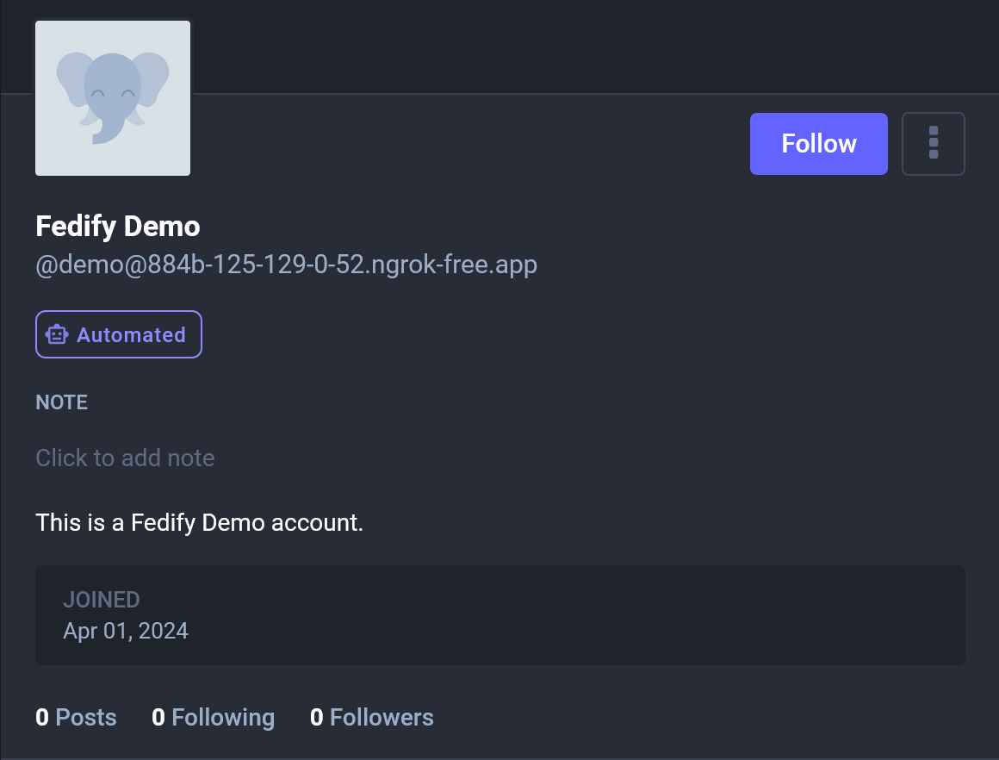
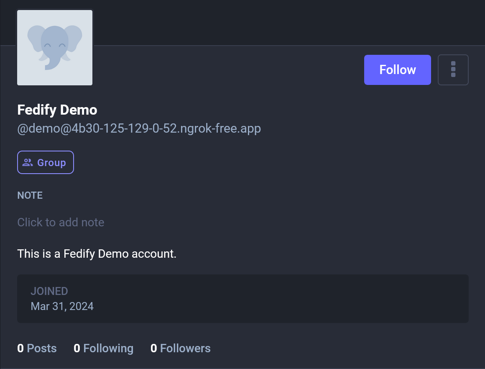

Pragmatics
==========

> [!NOTE]
> This section is a work in progress.  Contributions are welcome.

While Fedify provides [vocabulary API](./vocab.md), it does not inherently
define how to utilize those vocabularies.  ActivityPub implementations like
[Mastodon] and [Misskey] already have de facto norms for how to use them,
which you should follow to get the desired results.

For example, you need to know which properties on a `Person` object should be
populated with which values to display an avatar or header image, which property
represents a date joined, and so on.

In this section, we will explain the pragmatic aspects of using Fedify, such as
how to utilize the vocabulary API and the de facto norms of ActivityPub
implementations.

[Mastodon]: https://joinmastodon.org/
[Misskey]: https://misskey-hub.net/

Actors
------

The following five types of actors represent entities that can perform
activities in ActivityPub:

 -  `Application` describes a software application.
 -  `Group` represents a formal or informal collective of actors.
 -  `Organization` represents an organization.
 -  `Person` represents an individual person.
 -  `Service` represents a service of any kind.

The most common type of actor is `Person`, which represents an individual user.
When you register an [actor dispatcher], you should return an actor object of
an appropriate type of the account.

Those five types of actors have the same set of properties, e.g., `name`,
`preferredUsername`, `summary`, and `published`.

[actor dispatcher]: ./actor.md

### `Application`/`Service`: Automated/bot actors

If an actor is represented as an `Application` or `Service` object, it is
considered an automated actor by Mastodon and a bot actor by Misskey.

~~~~ typescript twoslash
import { Application } from "@fedify/fedify";
// ---cut-before---
new Application({  // [!code highlight]
  name: "Fedify Demo",
  preferredUsername: "demo",
  summary: "This is a Fedify Demo account",
  // Other properties...
})
~~~~

For example, the above actor object is displayed as an automated actor in
Mastodon like the following:

### `Group`

If an actor is represented as a `Group` object, it is considered a group actor
by Mastodon.

~~~~ typescript twoslash
import { Group } from "@fedify/fedify";
// ---cut-before---
new Group({  // [!code highlight]
  name: "Fedify Demo",
  preferredUsername: "demo",
  summary: "This is a Fedify Demo account",
  // Other properties...
})
~~~~

For example, the above actor object is displayed as a group actor in Mastodon
like the following:

> [!TIP]
> [Lemmy] communities and [Guppe] groups are also represented as `Group`
> objects.

[Lemmy]: https://join-lemmy.org/
[Guppe]: https://a.gup.pe/

### `name`: Display name

The `name` property is used as a display name in Mastodon and the most
ActivityPub implementations.  The display name is usually a full name or
a nickname of a person, or a title of a group or an organization.
It is displayed in the profile page of an actor and the timeline.

~~~~ typescript twoslash
import { Person } from "@fedify/fedify";
// ---cut-before---
new Person({
  name: "Fedify Demo",  // [!code highlight]
  preferredUsername: "demo",
  summary: "This is a Fedify Demo account",
  // Other properties...
})
~~~~

For example, the above actor object is displayed like the following in Mastodon:

### `summary`: Bio

The `summary` property is used as a bio in Mastodon and the most ActivityPub
implementations.  The bio is displayed in the profile page of the actor.

> [!NOTE]
> The `summary` property expects an HTML string, so you should escape HTML
> entities if it contains characters like `<`, `>`, and `&`.

~~~~ typescript twoslash
import { Person } from "@fedify/fedify";
// ---cut-before---
new Person({
  name: "Fedify Demo",
  preferredUsername: "demo",
  summary: "This is a Fedify Demo account",  // [!code highlight]
  // Other properties...
})
~~~~

For example, the above actor object is displayed like the following in Mastodon:

### `published`: Date joined

The `published` property is used as a date joined in Mastodon and Misskey.
The date joined is displayed in the profile page of the actor.

> [!NOTE]
> Although the `published` property contains a date and time, it is displayed
> as a date only in Mastodon and Misskey.  However, there may be ActivityPub
> implementations that display the date and time.

~~~~ typescript twoslash
import { Person } from "@fedify/fedify";
import { Temporal } from "@js-temporal/polyfill";
// ---cut-before---
new Person({
  name: "Fedify Demo",
  preferredUsername: "demo",
  summary: "This is a Fedify Demo account",
  published: Temporal.Instant.from("2024-03-31T00:00:00Z"), // [!code highlight]
  // Other properties...
})
~~~~

For example, the above actor object is displayed like the following in Mastodon:

### `icon`: Avatar image

The `icon` property is used as an avatar image in Mastodon and the most
ActivityPub implementations.  The avatar image is displayed next to the name
of the actor in the profile page and the timeline.

~~~~ typescript{5-8} twoslash
import { Image, Person } from "@fedify/fedify";
// ---cut-before---
new Person({
  name: "Fedify Demo",
  preferredUsername: "demo",
  summary: "This is a Fedify Demo account",
  icon: new Image({
    url: new URL("https://i.imgur.com/CUBXuVX.jpeg"),
    mediaType: "image/jpeg",
  }),
  // Other properties...
})
~~~~

For example, the above actor object is displayed like the following in Mastodon:

### `image`: Header image

The `image` property is used as a header image in Mastodon and Misskey.
The header image is displayed on the top of the profile page.

~~~~ typescript{5-8} twoslash
import { Image, Person } from "@fedify/fedify";
// ---cut-before---
new Person({
  name: "Fedify Demo",
  preferredUsername: "demo",
  summary: "This is a Fedify Demo account",
  image: new Image({
    url: new URL("https://i.imgur.com/yEZ0EEw.jpeg"),
    mediaType: "image/jpeg",
  }),
  // Other properties...
})
~~~~

For example, the above actor object is displayed like the following in Mastodon:

### `attachments`: Custom fields

The `attachments` property is used as custom fields in Mastodon and Misskey.
The custom fields are displayed as a table in the profile page.

~~~~ typescript{5-18} twoslash
import { Person, PropertyValue } from "@fedify/fedify";
// ---cut-before---
new Person({
  name: "Fedify Demo",
  preferredUsername: "demo",
  summary: "This is a Fedify Demo account",
  attachments: [
    new PropertyValue({
      name: "Location",
      value: "Seoul, South Korea",
    }),
    new PropertyValue({
      name: "Pronoun",
      value: "they/them",
    }),
    new PropertyValue({
      name: "Website",
      value: '<a href="https://fedify.dev/">fedify.dev</a>'
    }),
  ],
  // Other properties...
})
~~~~

> [!NOTE]
> The `PropertyValue.value` property expects an HTML string, so you should
> escape HTML entities if it contains characters like `<`, `>`, and `&`.

For example, the above actor object is displayed like the following in Mastodon:

### `manuallyApprovesFollowers`: Lock account

The `manuallyApprovesFollowers` property is used to *indicate* that the actor
manually approves followers.  In Mastodon and Misskey, the actor is displayed as
a locked account if the `manuallyApprovesFollowers` property is `true`.

> [!WARNING]
> The `manuallyApprovesFollowers` property only *indicates* that the actor
> manually approves followers.  The actual behavior of the actor is determined
> by the [inbox listener](./inbox.md) for `Follow` activities.
> If it automatically sends `Accept` activities right after receiving `Follow`,
> the actor behaves as an unlocked account.  If it sends `Accept` when the
> owner explicitly clicks the *Accept* button, the actor behaves as a locked
> account.

~~~~ typescript twoslash
import { Person } from "@fedify/fedify";
// ---cut-before---
new Person({
  name: "Fedify Demo",
  preferredUsername: "demo",
  summary: "This is a Fedify Demo account",
  manuallyApprovesFollowers: true,  // [!code highlight]
  // Other properties...
})
~~~~

For example, the above actor object is displayed like the following in Mastodon:

### `suspended`

The `suspended` property is used to suspend an actor in Mastodon.
If the `suspended` property is `true`, the profile page of the actor is
displayed as suspended.

~~~~ typescript twoslash
import { Person } from "@fedify/fedify";
// ---cut-before---
new Person({
  name: "Fedify Demo",
  preferredUsername: "demo",
  summary: "This is a Fedify Demo account",
  suspended: true,  // [!code highlight]
  // Other properties...
})
~~~~

For example, the above actor object is displayed like the following in Mastodon:

### `memorial`

The `memorial` property is used to memorialize an actor in Mastodon.
If the `memorial` property is `true`, the profile page of the actor is
displayed as memorialized.

~~~~ typescript twoslash
import { Person } from "@fedify/fedify";
// ---cut-before---
new Person({
  name: "Fedify Demo",
  preferredUsername: "demo",
  summary: "This is a Fedify Demo account",
  memorial: true,  // [!code highlight]
  // Other properties...
})
~~~~

For example, the above actor object is displayed like the following in Mastodon:

### `Federation.setFollowingDispatcher()`: Following collection

The `Federation.setFollowingDispatcher()` method registers a dispatcher for
the collection of actors that the actor follows.  The number of the collection
is displayed in the profile page of the actor.  Each item in the collection is
a URI of the actor that the actor follows, or an actor object itself.

~~~~ typescript twoslash
import type { Federation } from "@fedify/fedify";
const federation = null as unknown as Federation<void>;
// ---cut-before---
federation
  .setFollowingDispatcher(
    "/users/{identifier}/following", async (ctx, identifier, cursor) => {
      // Loads the list of actors that the actor follows...
      return {
        items: [
          new URL("..."),
          new URL("..."),
          // ...
        ]
      };
    }
  )
  .setCounter((ctx, identifier) => 123);
~~~~

For example, the above following collection is displayed like the below
in Mastodon:

> [!NOTE]
> Mastodon does not display the following collection of a remote actor,
> but other ActivityPub implementations may display it.

### `Federation.setFollowersDispatcher()`: Followers collection

The `Federation.setFollowersDispatcher()` method registers a dispatcher for
the collection of actors that follow the actor.  The number of the collection
is displayed in the profile page of the actor.  Each item in the collection is
a `Recipient` or an `Actor` that follows the actor.

~~~~ typescript twoslash
import type { Federation, Recipient } from "@fedify/fedify";
const federation = null as unknown as Federation<void>;
// ---cut-before---
federation
  .setFollowersDispatcher(
    "/users/{identifier}/followers", async (ctx, identifier, cursor) => {
      // Loads the list of actors that follow the actor...
      return {
        items: [
          {
            id: new URL("..."),
            inboxId: new URL("..."),
          } satisfies Recipient,
          // ...
        ]
      };
    }
  )
  .setCounter((ctx, identifier) => 456);
~~~~

For example, the above followers collection is displayed like the below
in Mastodon:

> [!NOTE]
> Mastodon does not display the followers collection of a remote actor,
> but other ActivityPub implementations may display it.
