Creating your own federated microblog
=====================================

> [!TIP]
>
> This tutorial is also available in the following languages: [한국어] (Korean)
> and [日本語] (Japanese).

In this tutorial, we will build a small [microblog] that implements
the ActivityPub protocol, similar to [Mastodon] or [Misskey], using [Fedify],
an ActivityPub server framework. This tutorial will focus more on how to
use Fedify rather than understanding its underlying operating principles.

If you have any questions, suggestions, or feedback, please feel free to join
our [Matrix chat space] or [GitHub Discussions].

[한국어]: https://hackmd.io/@hongminhee/fedify-tutorial-ko
[日本語]: https://zenn.dev/hongminhee/books/4a38b6358a027b
[microblog]: https://en.wikipedia.org/wiki/Microblogging
[Mastodon]: https://joinmastodon.org/
[Misskey]: https://misskey-hub.net/
[Fedify]: https://fedify.dev/
[Matrix chat space]: https://matrix.to/#/#fedify:matrix.org
[GitHub Discussions]: https://github.com/dahlia/fedify/discussions


Target audience
---------------

This tutorial is aimed at those who want to learn Fedify and create ActivityPub
server software.

We assume that you have experience in creating web applications using HTML
and HTTP, and that you understand command-line interfaces, SQL, JSON,
and basic JavaScript. However, you don't need to know TypeScript, JSX,
ActivityPub, or Fedify—we'll teach you what you need to know about these as
we go along.

You don't need experience in creating ActivityPub software, but we do assume
that you've used at least one ActivityPub software like Mastodon or Misskey.
This is so you have an idea of what we're trying to build.

*[JSX]: JavaScript XML


Goals
-----

In this tutorial, we'll use Fedify to create a single-user microblog that can
communicate with other federated software and services via ActivityPub.
This software will include the following features:

 -  Only one account can be created.
 -  Other accounts in the fediverse can follow the user.
 -  Followers can unfollow the user.
 -  The user can view their list of followers.
 -  The user can create posts.
 -  The user's posts are visible to followers in the fediverse.
 -  The user can follow other accounts in the fediverse.
 -  The user can view a list of accounts they are following.
 -  The user can view a chronological list of posts from accounts they follow.

To simplify the tutorial, we'll impose the following feature constraints:

 -  Account profiles (bio, photos, etc.) cannot be set.
 -  Once created, an account cannot be deleted.
 -  Once posted, a post cannot be edited or deleted.
 -  Once followed, another account cannot be unfollowed.
 -  There are no likes, shares, or comments.
 -  There is no search functionality.
 -  There are no security features such as authentication or permission checks.

Of course, after completing the tutorial, you're welcome to add these
features—it would be good practice!

The complete source code is available in the [GitHub repository],
with commits separated according to each implementation step for your reference.

[GitHub repository]: https://github.com/dahlia/microblog


Setting up the development environment
--------------------------------------

### Installing Node.js

Fedify supports three JavaScript runtimes: [Deno], [Bun], and [Node.js].
Among these, Node.js is the most widely used, so we'll use Node.js as the basis
for this tutorial.

> [!TIP]
> A JavaScript runtime is a platform that executes JavaScript code. Web browsers
> are one type of JavaScript runtime, and for command-line or server use,
> Node.js is widely used. Recently, cloud edge functions like
> [Cloudflare Workers] have also gained popularity as JavaScript runtimes.

To use Fedify, you need Node.js version 20.0.0 or higher. There are
[various installation methods]—choose the one that suits you best.

Once Node.js is installed, you'll have access to the `node` and `npm` commands:

~~~~ sh
node --version
npm --version
~~~~

### Installing the `fedify` command

To set up a Fedify project, you need to install the [`fedify`](../cli.md)
command on your system. There are
[several installation methods](../cli.md#installation),
but using the `npm` command is the simplest:

~~~~ sh
npm install -g @fedify/cli
~~~~

After installation, check if you can use the `fedify` command. You can check
the version of the `fedify` command with this command:

~~~~ sh
fedify --version
~~~~

Make sure the version number is 0.14.3 or higher. If it's an older version,
you won't be able to properly follow this tutorial.

### `fedify init` to initialize the project

To start a new Fedify project, let's decide on a directory path to work in.
In this tutorial, we'll name it *microblog*. Run the
[`fedify init`](../cli.md#fedify-init-initializing-a-fedify-project) command
followed by the directory path (it's okay if the directory doesn't exist yet):

~~~~ sh
fedify init microblog
~~~~

When you run the `fedify init` command, you'll see a series of prompts.
Select *Node.js*, *npm*, *Hono*, *In-memory*, and *In-process* in order:

~~~~ console
             ___      _____        _ _  __
            /'_')    |  ___|__  __| (_)/ _|_   _
     .-^^^-/  /      | |_ / _ \/ _` | | |_| | | |
   __/       /       |  _|  __/ (_| | |  _| |_| |
  <__.|_|-|_|        |_|  \___|\__,_|_|_|  \__, |
                                           |___/

? Choose the JavaScript runtime to use
  Deno
  Bun
❯ Node.js

? Choose the package manager to use
❯ npm
  Yarn
  pnpm

? Choose the web framework to integrate Fedify with
  Bare-bones
  Fresh
❯ Hono
  Express
  Nitro

? Choose the key-value store to use for caching
❯ In-memory
  Redis
  Deno KV

? Choose the message queue to use for background jobs
❯ In-process
  Redis
  Deno KV
~~~~

> [!NOTE]
> Fedify is not a full-stack framework, but rather a framework specialized for
> implementing ActivityPub servers. Therefore, it's designed to be used
> alongside other web frameworks. In this tutorial, we'll adopt [Hono] as
> our web framework to use with Fedify.

After a moment, you'll see files created in your working directory with
the following structure:

 -  *.vscode/* — Visual Studio Code related settings
     -  *extensions.json* — Recommended extensions for Visual Studio Code
     -  *settings.json* — Visual Studio Code settings
 -  *node_modules/* — Directory where dependent packages are installed
    (contents omitted)
 -  *src/* — Source code
     -  *app.tsx* — Server unrelated to ActivityPub
     -  *federation.ts* — ActivityPub server
     -  *index.ts* — Entry point
     -  *logging.ts* — Logging configuration
 -  *biome.json* — Formatter and linter settings
 -  *package.json* — Package metadata
 -  *tsconfig.json* — TypeScript settings

As you might guess, we're using TypeScript instead of JavaScript,
which is why we have *.ts* and *.tsx* files instead of *.js* files.

The generated source code is a working demo. Let's first check if it runs
properly:

~~~~ sh
npm run dev
~~~~

This command will keep the server running until you press
<kbd>Ctrl</kbd>+<kbd>C</kbd>:

~~~~ console
Server started at http://0.0.0.0:8000
~~~~

With the server running, open a new terminal tab and run the following command:

~~~~ sh
fedify lookup http://localhost:8000/users/john
~~~~

This command queries an actor (actor) on the ActivityPub server we've set up
locally. In ActivityPub, an actor can be thought of as an account that's
accessible across various ActivityPub servers.

If you see output like this, it's working correctly:

~~~~ console
✔ Looking up the object...
Person {
  id: URL "http://localhost:8000/users/john",
  name: "john",
  preferredUsername: "john"
}
~~~~

This result tells us that there's an actor object located at the */users/john*
path, it's of type `Person`, its ID is *http://localhost:8000/users/john*,
its name is *john*, and its username is also *john*.

> [!TIP]
> [`fedify lookup`](../cli.md#fedify-lookup-looking-up-an-activitypub-object)
> is a command to query ActivityPub objects. This is equivalent
> to searching with the corresponding URI on Mastodon. (Of course, since your
> server is only accessible locally at the moment, searching on Mastodon won't
> yield any results yet.)
>
> If you prefer `curl` over the `fedify lookup` command, you can also query
> the actor with this command (note that we're sending the <code>Accept</code>
> header with the `-H` option):
>
> ~~~~ sh
> curl -H"Accept: application/activity+json" http://localhost:8000/users/john
> ~~~~
>
> However, if you query like this, the result will be in JSON format,
> which is difficult to read with the naked eye. If you also have the `jq`
> command installed on your system, you can use `curl` and `jq` together:
>
> ~~~~sh
> curl -H"Accept: application/activity+json" http://localhost:8000/users/john | jq .
> ~~~~

### Visual Studio Code

[Visual Studio Code] might not be your favorite editor. However, we recommend
using Visual Studio Code while following this tutorial. This is because we need
to use TypeScript, and Visual Studio Code is currently the most convenient and
excellent TypeScript IDE. Also, the generated project setup already includes
Visual Studio Code settings, so you don't have to wrestle with formatters or
linters.

> [!WARNING]
> Don't confuse this with Visual Studio. Visual Studio Code and Visual Studio
> only share a brand name; they are completely different software.

After [installing Visual Studio Code], open the working directory by selecting
*File* → *Open Folder…* from the menu.

If you see a popup in the bottom right asking <q>Do you want to install
the recommended 'Biome' extension from biomejs for this repository?</q>,
click the *Install* button to install the extension. Installing this extension
will automatically format your TypeScript code, so you don't have to wrestle
with code styles like indentation or spacing when writing TypeScript code.

> [!TIP]
> If you're a loyal Emacs or Vim user, we won't discourage you from using your
> favorite editor. However, we recommend setting up TypeScript LSP.
> The difference in productivity depending on whether TypeScript LSP is set up
> or not is significant.

[Deno]: https://deno.com/
[Bun]: https://bun.sh/
[Node.js]: https://nodejs.org/
[Cloudflare Workers]: https://workers.cloudflare.com/
[various installation methods]: https://nodejs.org/en/download/package-manager
[Hono]: https://hono.dev/
[Visual Studio Code]: https://code.visualstudio.com/
[installing Visual Studio Code]: https://code.visualstudio.com/docs/setup/setup-overview

*[LSP]: Language Server Protocol


Prerequisites
-------------

### TypeScript

Before we start modifying code, let's briefly go over TypeScript.
If you're already familiar with TypeScript, you can skip this section.

TypeScript adds static type checking to JavaScript. The TypeScript syntax is
almost the same as JavaScript, but the main difference is that you can specify
types for variables and functions. Types are specified by adding a colon (`:`)
after the variable or parameter.

For example, the following code indicates that the `foo` variable is a `string`:

~~~~ typescript twoslash
let foo: string;
~~~~

If you try to assign a value of a different type to a variable declared like
this, Visual Studio Code will show a red underline *before you even run it* and
display a type error:

~~~~ typescript twoslash
// @errors: 2322
let foo: string;
// ---cut-before---
foo = 123;
~~~~

When coding, don't ignore red underlines. If you ignore them and run
the program, it's likely that an error will actually occur at that part.

The most common type of error you'll encounter when coding in TypeScript is
the `null` possibility error. For example, in the following code, the `bar`
variable can be either a `string` or `null` (`string | null`):

~~~~ typescript twoslash
function someFunction(): string | null { return ""; }
// ---cut-before---
const bar: string | null = someFunction();
~~~~

What happens if you try to get the first character of this variable's content
like this?

~~~~ typescript twoslash
// @errors: 18047
function someFunction(): string | null { return ""; }
const bar: string | null = someFunction();
// ---cut-before---
const firstChar = bar.charAt(0);
~~~~

You'll get a type error like above. It's saying that `bar` might sometimes be
`null`, and in that case, calling `null.charAt(0)` would cause an error,
so you need to fix the code. In such cases, you need to add handling for
the `null` case like this:

~~~~ typescript twoslash
function someFunction(): string | null { return ""; }
const bar: string | null = someFunction();
// ---cut-before---
const firstChar = bar === null ? "" : bar.charAt(0);
~~~~

In this way, TypeScript helps prevent bugs by making you think of cases you
might not have considered when coding.

Another incidental advantage of TypeScript is that it enables auto-completion.
For example, if you type `foo.`, a list of methods available for string objects
will appear, allowing you to choose from them. This allows for faster coding
without having to check documentation each time.

We hope you'll feel the charm of TypeScript as you follow this tutorial.
Above all, Fedify provides the best experience when used with TypeScript.

> [!TIP]
> If you want to learn TypeScript properly and thoroughly, we recommend reading
> *[The TypeScript Handbook]*. It takes about 30 minutes to read it all.

### JSX

JSX is a syntax extension of JavaScript that allows you to insert XML or HTML
into JavaScript code. It can also be used in TypeScript, in which case it's
sometimes called TSX. In this tutorial, we'll write all HTML within JavaScript
code using JSX syntax. Those who are already familiar with JSX can skip this
section.

For example, the following code assigns an HTML tree with a `<div>` element
at the top to the `html` variable:

~~~~ tsx twoslash
const html = <div>
  <p id="greet">Hello, <strong>JSX</strong>!</p>
</div>;
~~~~

You can also insert JavaScript expressions using curly braces (the following
code assumes, of course, that there's a `getName()` function):

~~~~ tsx twoslash
/**
 * A hypothetical function that returns a name.
 */
function getName(): string { return ""; }
// ---cut-before---
const html = <div title={"Hello, " + getName() + "!"}>
  <p id="greet">Hello, <strong>{getName()}</strong>!</p>
</div>;
~~~~

One of the features of JSX is that you can define your own tags called
components. Components can be defined as ordinary JavaScript functions.
For example, the following code defines and uses a `<Container>` component
(component names typically follow PascalCase style):

~~~~ tsx twoslash
import type { Child, FC } from "hono/jsx";

function getName() {
  return "JSX";
}

interface ContainerProps {
  name: string;
  children: Child;
}

const Container: FC<ContainerProps> = (props) => {
  return <div title={"Hello, " + props.name + "!"}>{props.children}</div>;
};

const html = <Container name={getName()}>
  <p id="greet">Hello, <strong>{getName()}</strong>!</p>
</Container>;
~~~~

In the above code, `FC` is provided by [Hono], the web framework we'll use,
and it helps define the type of the component. `FC` is a generic type,
and the types that go inside the angle brackets after `FC` are type arguments.
Here, we specify the props type as the type argument. Props refer to
the parameters passed to the component. In the above code, we declared and
used the `ContainerProps` interface as the props type for the `<Container>`
component.

> [!TIP]
> Type arguments for generic types can be multiple, separated by commas.
> For example, `Foo<A, B>` applies type arguments `A` and `B` to the generic
> type `Foo`.
>
> There are also generic functions, which are written as
> `someFunction<A, B>(foo, bar)`.
>
> When there's only one type argument, the angle brackets enclosing the type
> argument may look like XML/HTML tags, but they have nothing to do with JSX
> functionality.
>
> `FC<ContainerProps>`
> :   Applies the type argument `ContainerProps` to the generic type `FC`.
>
> `<Container>`
> :   Opens a component tag named `<Container>`. Must be closed with
>     `</Container>`.

Among the things passed as props, `children` is worth noting specifically. This is because the child elements of the component are passed as the `children` prop.
As a result, in the above code, the `html` variable is assigned the HTML tree
`<div title="Hello, JSX!"><p id="greet">Hello, <strong>JSX</strong>!</p></div>`.

> [!TIP]
> JSX was invented in the React project and started to be widely used.
> If you want to know more about JSX, read the *[Writing Markup with JSX]* and 
> *[JavaScript in JSX with Curly Braces]* sections of the React documentation.

[The TypeScript Handbook]: https://www.typescriptlang.org/docs/handbook/intro.html
[Writing Markup with JSX]: https://react.dev/learn/writing-markup-with-jsx
[JavaScript in JSX with Curly Braces]: https://react.dev/learn/javascript-in-jsx-with-curly-braces


Account creation page
---------------------

The first thing we'll create is the account creation page. We need to create
an account before we can post or follow other accounts. Let's start by building
the visible part.

First, let's create a file named *src/views.tsx*. Inside this file, we'll define
a `<Layout>` component using JSX:

~~~~ tsx twoslash
import type { FC } from "hono/jsx";

export const Layout: FC = (props) => (
  <html lang="en">
    <head>
      <meta charset="utf-8" />
      <meta name="viewport" content="width=device-width, initial-scale=1" />
      <meta name="color-scheme" content="light dark" />
      <title>Microblog</title>
      <link
        rel="stylesheet"
        href="https://cdn.jsdelivr.net/npm/@picocss/pico@2/css/pico.min.css"
      />
    </head>
    <body>
      <main class="container">{props.children}</main>
    </body>
  </html>
);
~~~~

To avoid spending too much time on design, we'll use a CSS framework called
[Pico CSS].

> [!TIP]
> When the type of a variable or parameter can be inferred by TypeScript's type
> checker, like `props` above, it's fine to omit the type annotation. Even when
> the type annotation is omitted in such cases, you can check the type of
> a variable by hovering your mouse cursor over the variable name in
> Visual Studio Code.

Next, in the same file, let's define a `<SetupForm>` component that will go
inside the layout:

~~~~ tsx twoslash
import type { FC } from "hono/jsx";
// ---cut-before---
export const SetupForm: FC = () => (
  <>
    <h1>Set up your microblog</h1>
    <form method="post" action="/setup">
      <fieldset>
        <label>
          Username{" "}
          <input
            type="text"
            name="username"
            required
            maxlength={50}
            pattern="^[a-z0-9_\-]+$"
          />
        </label>
      </fieldset>
      <input type="submit" value="Setup" />
    </form>
  </>
);
~~~~

In JSX, you can only have one top-level element, but the `<SetupForm>` component
has two top-level elements: `<h1>` and `<form>`. That's why we've wrapped them
with `<>` and `</>`. This is called a fragment.

Now it's time to use the components we've defined. Open the *src/app.tsx* file
and `import` the two components we just defined:

~~~~ tsx twoslash
// @noErrors: 2395 2307
import type { FC } from "hono/jsx";
export const Layout: FC = (props) => <html/>;
export const SetupForm: FC = () => <></>;
// ---cut-before---
import { Layout, SetupForm } from "./views.tsx";
~~~~

Then, display the account creation form we just made on the */setup* page:

~~~~ tsx twoslash
import { Hono } from "hono";
const app = new Hono();
import type { FC } from "hono/jsx";
export const Layout: FC = (props) => <html/>;
export const SetupForm: FC = () => <></>;
// ---cut-before---
app.get("/setup", (c) =>
  c.html(
    <Layout>
      <SetupForm />
    </Layout>,
  ),
);
~~~~

Now, let's open the <http://localhost:8000/setup> page in a web browser.
If you see a screen like this, it's working correctly:

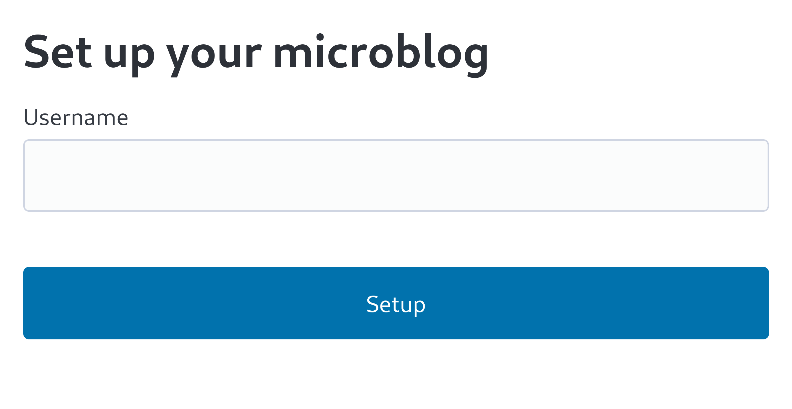

> [!NOTE]
> To use JSX, the source file extension must be *.jsx* or *.tsx*.
> Note that both files we edited in this section have the *.tsx* extension.

### Database setup

Now that we've implemented the visible part, it's time to implement
the functionality. We need a place to store account information, so let's use
[SQLite]. SQLite is a relational database suitable for small-scale applications.

First, let's declare a table to hold account information. From now on, we'll
write all table declarations in the *src/schema.sql* file. We'll store account
information in the `users` table:

~~~~ sql
CREATE TABLE IF NOT EXISTS users (
  id       INTEGER NOT NULL PRIMARY KEY CHECK (id = 1),
  username TEXT    NOT NULL UNIQUE      CHECK (trim(lower(username)) = username
                                               AND username <> ''
                                               AND length(username) <= 50)
);
~~~~

Since the microblog we're creating can only have one account, we've put 
a constraint on the `id` column, which is the primary key, to not allow values
other than `1`. This ensures that the `users` table can't contain more than one
record. We've also put constraints on the `username` column to not allow empty
strings or strings that are too long.

Now we need to run the *src/schema.sql* file to create the users table.
For this, we need the `sqlite3` command, which you can
[get from the SQLite website] or install from your platform's package manager.
For macOS, you don't need to get it separately as it is built into the system.
If you get it directly, you can get the *sqlite-tools-\*.zip* file for your
OS and unzip it. If you use a package manager, you can also install it with
the following command:

::: code-group

~~~~ sh [Debian & Ubuntu]
sudo apt install sqlite3
~~~~

~~~~ sh [Fedora & RHEL]
sudo dnf install sqlite
~~~~

~~~~ powershell [Chocolatey]
choco install sqlite
~~~~

~~~~ powershell [Scoop]
scoop install sqlite
~~~~

~~~~ powershell [Windows Package Manager]
winget install SQLite.SQLite
~~~~

:::

Okay, now that we have the `sqlite3` command, let's use it to create
a database file:

~~~~ sh
sqlite3 microblog.sqlite3 < src/schema.sql
~~~~

The above command will create a *microblog.sqlite3* file, which will store your
SQLite data.

[get from the SQLite website]: https://www.sqlite.org/download.html

### Connecting to the database in the app

Now we need to use the SQLite database in our app. To use SQLite database in
Node.js, we need a SQLite driver library, and we'll use the *[better-sqlite3]*
package. You can easily install the package with the `npm` command:

~~~~ sh
npm add better-sqlite3
npm add --save-dev @types/better-sqlite3
~~~~

> [!TIP]
> The *[@types/better-sqlite3]* package contains type information about
> the *better-sqlite3* package's API for TypeScript. You need to install this
> package to enable auto-completion and type checking when editing in Visual
> Studio Code.
>
> Packages like this in the *@types/* scope are called [Definitely Typed]
> packages. When a library is not written in TypeScript, the community adds
> type information and makes it into a package.

Now that we've installed the package, let's write code to connect to
the database using this package. Create a new file named *src/db.ts* and code
it as follows:

~~~~ typescript twoslash
import Database from "better-sqlite3";

const db = new Database("microblog.sqlite3");
db.pragma("journal_mode = WAL");
db.pragma("foreign_keys = ON");

export default db;
~~~~

> [!TIP]
> The settings made through the `db.pragma()` function have the following
> effects:
>
> [`journal_mode = WAL`]
> :   Adopts [Write-Ahead Logging] mode as a way to implement atomic commits and
>     rollbacks in SQLite. This mode is generally more performant than
>     the default [rollback journal] mode.
>
> [`foreign_keys = ON`]
> :   By default, SQLite does not check foreign key constraints. Turning on this
>     setting makes it check foreign key constraints, which helps maintain data
>     integrity.

Now let's declare a type in JavaScript to represent the record stored in
the `users` table. Create a *src/schema.ts* file and define the `User` type
as follows:

~~~~ typescript twoslash
export interface User {
  id: number;
  username: string;
}
~~~~

[better-sqlite3]: https://github.com/WiseLibs/better-sqlite3
[@types/better-sqlite3]: https://www.npmjs.com/package/@types/better-sqlite3
[Definitely Typed]: https://github.com/DefinitelyTyped/DefinitelyTyped
[`journal_mode = WAL`]: https://www.sqlite.org/wal.html
[Write-Ahead Logging]: https://en.wikipedia.org/wiki/Write-ahead_logging
[rollback journal]: https://www.sqlite.org/lockingv3.html#rollback
[`foreign_keys = ON`]: https://www.sqlite.org/foreignkeys.html#fk_enable

### Record insertion

Now that we've connected to the database, it's time to write code to insert
records.

Open the *src/app.tsx* file and `import` the `db` object and `User` type that
will be used for record insertion:

~~~~ typescript twoslash
// @noErrors: 2307
import Database from "better-sqlite3";
const db = new Database("");
interface User {}
// ---cut-before---
import db from "./db.ts";
import type { User } from "./schema.ts";
~~~~

Implement the `POST /setup` handler:

~~~~ typescript twoslash
import { Hono } from "hono";
const app = new Hono();
import Database from "better-sqlite3";
const db = new Database("");
interface User {}
// ---cut-before---
app.post("/setup", async (c) => {
  // Check if an account already exists
  const user = db.prepare<unknown[], User>("SELECT * FROM users LIMIT 1").get();
  if (user != null) return c.redirect("/");

  const form = await c.req.formData();
  const username = form.get("username");
  if (typeof username !== "string" || !username.match(/^[a-z0-9_-]{1,50}$/)) {
    return c.redirect("/setup");
  }
  db.prepare("INSERT INTO users (username) VALUES (?)").run(username);
  return c.redirect("/");
});
~~~~

Add code to check if an account already exists to the `GET /setup` handler
we created earlier:

~~~~ tsx{2-4} twoslash
import { Hono } from "hono";
const app = new Hono();
import type { FC } from "hono/jsx";
export const Layout: FC = (props) => <html/>;
export const SetupForm: FC = () => <></>;
import Database from "better-sqlite3";
const db = new Database("");
interface User {}
// ---cut-before---
app.get("/setup", (c) => {
  // Check if an account already exists
  const user = db.prepare<unknown[], User>("SELECT * FROM users LIMIT 1").get();
  if (user != null) return c.redirect("/");

  return c.html(
    <Layout>
      <SetupForm />
    </Layout>,
  );
});
~~~~

### Testing

Now that we've roughly implemented the account creation feature, let's try it
out. Open the <http://localhost:8000/setup> page in a web browser and create
an account. In this tutorial, we'll assume that we used *johndoe* as
the username. If it's created, let's also check if the record was properly
inserted into the SQLite database:

~~~~ sh
echo "SELECT * FROM users;" | sqlite3 -table microblog.sqlite3
~~~~

If the record was properly inserted, you should see output like this (of course,
`johndoe` will be whatever username you entered):

| `id` | `username` |
|------|------------|
| `1`  | `johndoe`  |

[Pico CSS]: https://picocss.com/
[SQLite]: https://www.sqlite.org/


Profile page
------------

Now that we've created an account, let's implement a profile page to display
the account information. Although we don't have much information to show yet.

Let's start with the visible part again. Open the *src/views.tsx* file and
define a `<Profile>` component:

~~~~ tsx twoslash
import type { FC } from "hono/jsx";
// ---cut-before---
export interface ProfileProps {
  name: string;
  handle: string;
}

export const Profile: FC<ProfileProps> = ({ name, handle }) => (
  <>
    <hgroup>
      <h1>{name}</h1>
      <p style="user-select: all;">{handle}</p>
    </hgroup>
  </>
);
~~~~

Then, open the *src/app.tsx* file and `import` the component we just defined:

~~~~ tsx twoslash
// @noErrors: 2395 2307
import type { FC } from "hono/jsx";
export const Layout: FC = (props) => <html/>;
export const Profile: FC = () => <></>;
export const SetupForm: FC = () => <></>;
// ---cut-before---
import { Layout, Profile, SetupForm } from "./views.tsx";
~~~~

And add a `GET /users/{username}` request handler that displays the `<Profile>`
component:

~~~~ tsx twoslash
import { Hono } from "hono";
const app = new Hono();
import type { FC } from "hono/jsx";
export const Layout: FC = (props) => <html/>;
export const Profile: FC = () => <></>;
import Database from "better-sqlite3";
const db = new Database("");
interface User {
  username: string;
}
// ---cut-before---
app.get("/users/:username", async (c) => {
  const user = db
    .prepare<unknown[], User>("SELECT * FROM users WHERE username = ?")
    .get(c.req.param("username"));
  if (user == null) return c.notFound();

  const url = new URL(c.req.url);
  const handle = `@${user.username}@${url.host}`;
  return c.html(
    <Layout>
      <Profile name={user.username} handle={handle} />
    </Layout>,
  );
});
~~~~

Now let's test if it displays correctly.
Open the <http://localhost:8000/users/johndoe> page in your web browser
(if you created an account with a username other than `johndoe`,
change the URL accordingly). You should see a screen like this:

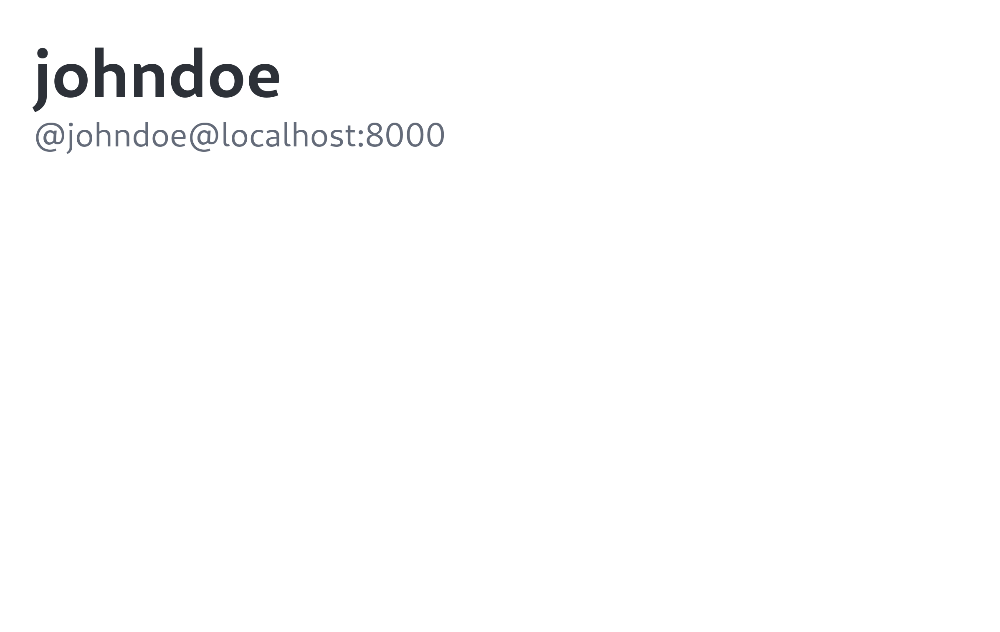

> [!TIP]
> A fediverse handle, or simply handle, is a unique address that identifies
> an account in the fediverse. For example, it looks like
> `@hongminhee@fosstodon.org`. It's similar to an email address,
> and its structure is also similar to an email address. It starts with `@`,
> followed by a name, then another `@`, and finally the domain name of
> the server the account belongs to. Sometimes the initial `@` is omitted.
>
> Technically, handles are implemented using two standards: [WebFinger] and
> the [`acct:` URI scheme]. Thanks to Fedify implementing these, you don't need
> to know the implementation details while following this tutorial.

[WebFinger]: https://datatracker.ietf.org/doc/html/rfc7033
[`acct:` URI scheme]: https://datatracker.ietf.org/doc/html/rfc7565


## Implementing the actor

As the name suggests, ActivityPub is a protocol for exchanging activities.
Writing a post, editing a post, deleting a post, liking a post, commenting,
editing a profile… All actions that happen in social media are expressed as
activities.

And all activities are transmitted from actor to actor. For example, when John
Doe writes a post, a <q>writing</q> (`Create(Note)`) activity is sent from Joh
Doe to John Doe's followers. If Jane Doe likes that post, a <q>liking</q>
(`Like`) activity is sent from Jane Doe to John Doe.

Therefore, the first step in implementing ActivityPub is to implement the actor.

The demo app generated by the `fedify init` command already has a very simple
actor implemented, but to communicate with actual software like Mastodon or
Misskey, we need to implement the actor more properly.

First, let's take a look at the current implementation.
Open the *src/federation.ts* file:

~~~~ typescript{12-18} twoslash
import { Person, createFederation } from "@fedify/fedify";
import { InProcessMessageQueue, MemoryKvStore } from "@fedify/fedify";
import { getLogger } from "@logtape/logtape";

const logger = getLogger("microblog");

const federation = createFederation({
  kv: new MemoryKvStore(),
  queue: new InProcessMessageQueue(),
});

federation.setActorDispatcher("/users/{handle}", async (ctx, handle) => {
  return new Person({
    id: ctx.getActorUri(handle),
    preferredUsername: handle,
    name: handle,
  });
});

export default federation;
~~~~

The part we should focus on is the `~Federation.setActorDispatcher()` method.
This method defines the URL and behavior that other ActivityPub software will
use when querying an actor on our server. For example, if we query
*/users/johndoe* as we did earlier, the `handle` parameter of the callback
function will receive the string value `"johndoe"`. And the callback function
returns an instance of the `Person` class to convey the information of
the queried actor.

The `ctx` parameter receives a `Context` object, which contains various
functions related to the ActivityPub protocol. For example,
the `~Context.getActorUri()` method used in the above code returns the unique
URI of the actor with the `handle` passed as a parameter. This URI is being used
as the unique identifier of the `Person` object.

As you can see from the implementation code, currently it's *making up* actor
information and returning it for any handle that comes after the */users/* path.
But what we want is to only allow queries for accounts that are actually
registered. Let's modify this part to only return for accounts in the database.

### Table creation

We need to create an `actors` table. Unlike the `users` table which only
contains accounts on the current instance server, this table will also include
remote actors belonging to federated servers. The table looks like this.
Add the following SQL to the *src/schema.sql* file:

~~~~ sql
CREATE TABLE IF NOT EXISTS actors (
  id               INTEGER NOT NULL PRIMARY KEY,
  user_id          INTEGER          REFERENCES users (id),
  uri              TEXT    NOT NULL UNIQUE CHECK (uri <> ''),
  handle           TEXT    NOT NULL UNIQUE CHECK (handle <> ''),
  name             TEXT,
  inbox_url        TEXT    NOT NULL UNIQUE CHECK (inbox_url LIKE 'https://%'
                                                  OR inbox_url LIKE 'http://%'),
  shared_inbox_url TEXT                    CHECK (shared_inbox_url
                                                  LIKE 'https://%'
                                                  OR shared_inbox_url
                                                  LIKE 'http://%'),
  url              TEXT                    CHECK (url LIKE 'https://%'
                                                  OR url LIKE 'http://%'),
  created          TEXT    NOT NULL DEFAULT (CURRENT_TIMESTAMP)
                                           CHECK (created <> '')
);
~~~~

 -  The `user_id` column is a foreign key to connect with the `users` column.
    If the record represents a remote actor, it will be `NULL`, but if it's
    an account on the current instance server, it will contain the `users.id`
    value of that account.

 -  The `uri` column contains the unique URI of the actor, also called the actor
    ID. All ActivityPub objects, including actors, have a unique ID in URI form.
    Therefore, it cannot be empty and cannot be duplicated.

 -  The `handle` column contains the fediverse handle in the form of
    `@johndoe@example.com`. Likewise, it cannot be empty and cannot be
    duplicated.

 -  The `name` column contains the name displayed in the UI. It usually contains
    a full name or nickname. However, according to the ActivityPub
    specification, this column can be empty.

 -  The `inbox_url` column contains the URL of the actor's inbox.
    We'll explain in detail what an inbox is below, but for now, just know that
    it must exist for the actor. This column also cannot be empty or duplicated.

 -  The `shared_inbox_url` column contains the URL of the actor's shared inbox,
    which we'll also explain below. It's not mandatory, so it can be empty,
    and as the column name suggests, it can share the same shared inbox URL with
    other actors.

 -  The `url` column contains the profile URL of the actor. A profile URL means
    the URL of the profile page that can be opened in a web browser.
    Sometimes the actor's ID and profile URL are the same, but they can be
    different depending on the service, so in that case, the profile URL is
    stored in this column. It can be empty.

 -  The `created` column records when the record was created.
    It cannot be empty, and by default, the insertion time is recorded.

Now, let's apply the *src/schema.sql* file to the *microblog.sqlite3* database
file:

~~~~ sh
sqlite3 microblog.sqlite3 < src/schema.sql
~~~~

And let's define a type in *src/schema.ts* to represent records stored in 
the `actors` table in JavaScript:

~~~~ typescript twoslash
export interface Actor {
  id: number;
  user_id: number | null;
  uri: string;
  handle: string;
  name: string | null;
  inbox_url: string;
  shared_inbox_url: string | null;
  url: string | null;
  created: string;
}
~~~~

### Actor record

Although we currently have one record in the `users` table, there's no
corresponding record in the `actors` table. This is because we didn't add
a record to the `actors` table when creating the account. We need to modify
the account creation code to add records to both `users` and `actors`.

First, let's modify the `SetupForm` in *src/views.tsx* to also input a name
that will go into the `actors.name` column along with the username:

~~~~ tsx{16-18} twoslash
import type { FC } from "hono/jsx";
// ---cut-before---
export const SetupForm: FC = () => (
  <>
    <h1>Set up your microblog</h1>
    <form method="post" action="/setup">
      <fieldset>
        <label>
          Username{" "}
          <input
            type="text"
            name="username"
            required
            maxlength={50}
            pattern="^[a-z0-9_\-]+$"
          />
        </label>
        <label>
          Name <input type="text" name="name" required />
        </label>
      </fieldset>
      <input type="submit" value="Setup" />
    </form>
  </>
);
~~~~

Now `import` the <code>Actor</code> type we defined earlier in *src/app.tsx*:

~~~~ typescript
import type { Actor, User } from "./schema.ts";
~~~~

Now let's add code to the `POST /setup` handler to create a record in
the `actors` table with the input name and other necessary information:

~~~~ typescript{7,19-24,26,30-44} twoslash
import { Hono } from "hono";
const app = new Hono();
import Database from "better-sqlite3";
const db = new Database("");
interface User {}
import type { Federation } from "@fedify/fedify";
const fedi = null as unknown as Federation<void>;
// ---cut-before---
app.post("/setup", async (c) => {
  // Check if an account already exists
  const user = db
    .prepare<unknown[], User>(
      `
      SELECT * FROM users
      JOIN actors ON (users.id = actors.user_id)
      LIMIT 1
      `,
    )
    .get();
  if (user != null) return c.redirect("/");

  const form = await c.req.formData();
  const username = form.get("username");
  if (typeof username !== "string" || !username.match(/^[a-z0-9_-]{1,50}$/)) {
    return c.redirect("/setup");
  }
  const name = form.get("name");
  if (typeof name !== "string" || name.trim() === "") {
    return c.redirect("/setup");
  }
  const url = new URL(c.req.url);
  const handle = `@${username}@${url.host}`;
  const ctx = fedi.createContext(c.req.raw, undefined);
  db.transaction(() => {
    db.prepare("INSERT OR REPLACE INTO users (id, username) VALUES (1, ?)").run(
      username,
    );
    db.prepare(
      `
      INSERT OR REPLACE INTO actors
        (user_id, uri, handle, name, inbox_url, shared_inbox_url, url)
      VALUES (1, ?, ?, ?, ?, ?, ?)
    `,
    ).run(
      ctx.getActorUri(username).href,
      handle,
      name,
      ctx.getInboxUri(username).href,
      ctx.getInboxUri().href,
      ctx.getActorUri(username).href,
    );
  })();
  return c.redirect("/");
});
~~~~

When checking if an account already exists, we modified it to determine that
there's no account yet not only when there's no record in the `users` table,
but also when there's no matching record in the `actors` table. Apply the same
condition to the `GET /setup` handler and the `GET /users/{username}` handler:

~~~~ tsx{7} twoslash
import { Hono } from "hono";
const app = new Hono();
import Database from "better-sqlite3";
const db = new Database("");
interface User {}
import type { FC } from "hono/jsx";
export const Layout: FC = (props) => <html/>;
export const SetupForm: FC = () => <></>;
// ---cut-before---
app.get("/setup", (c) => {
  // Check if the user already exists
  const user = db
    .prepare<unknown[], User>(
      `
      SELECT * FROM users
      JOIN actors ON (users.id = actors.user_id)
      LIMIT 1
      `,
    )
    .get();
  if (user != null) return c.redirect("/");

  return c.html(
    <Layout>
      <SetupForm />
    </Layout>,
  );
});
~~~~

~~~~ tsx{6} twoslash
import { Hono } from "hono";
const app = new Hono();
import Database from "better-sqlite3";
const db = new Database("");
interface Actor { name: string; }
interface User { username: string; }
import type { FC } from "hono/jsx";
export const Layout: FC = (props) => <html/>;
export const Profile: FC = () => <></>;
// ---cut-before---
app.get("/users/:username", async (c) => {
  const user = db
    .prepare<unknown[], User & Actor>(
      `
      SELECT * FROM users
      JOIN actors ON (users.id = actors.user_id)
      WHERE username = ?
      `,
    )
    .get(c.req.param("username"));
  if (user == null) return c.notFound();

  const url = new URL(c.req.url);
  const handle = `@${user.username}@${url.host}`;
  return c.html(
    <Layout>
      <Profile name={user.name ?? user.username} handle={handle} />
    </Layout>,
  );
});
~~~~

> [!TIP]
> In TypeScript, `A & B` means an object that is both type `A` and type `B`.
> For example, given the type `{ a: number } & { b: string }`, `{ a: 123 }` or
> `{ b: "foo" }` do not satisfy this type, but `{ a: 123, b: "foo" }` does
> satisfy this type.

Finally, open the *src/federation.ts* file and add the following code below
the actor dispatcher:

~~~~ typescript twoslash
import type { Federation } from "@fedify/fedify";
const federation = null as unknown as Federation<void>;
// ---cut-before---
federation.setInboxListeners("/users/{handle}/inbox", "/inbox");
~~~~

Don't worry about the `~Federation.setInboxListeners()` method for now.
We'll cover this when we explain about the inbox. Just note that
the `~Context.getInboxUri()` method used in the account creation code needs
the above code to work properly.

If you've modified all the code, open the <http://localhost:8000/setup> page
in your browser and create an account again:

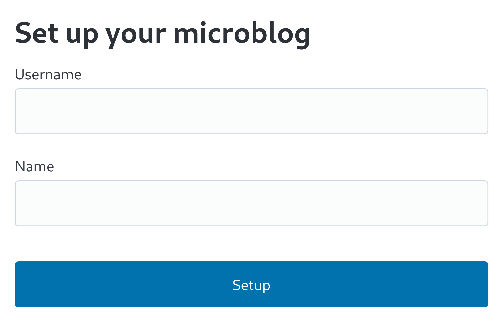

### Actor dispatcher

Now that we've created the `actors` table and filled in a record, let's modify
*src/federation.ts* again. First, `import` `Endpoints` and <code>Actor</code>:

~~~~ typescript twoslash
// @noErrors: 2307
import { Endpoints, Person, createFederation } from "@fedify/fedify";
import type { Actor, User } from "./schema.ts";
~~~~

Now that we've `import`ed what we need, let's modify
the `~Federation.setActorDispatcher()` method:

~~~~ typescript{2-11,16-21} twoslash
import { Endpoints, Person, type Federation } from "@fedify/fedify";
import Database from "better-sqlite3";
const db = new Database("");
interface User {}
interface Actor { name: string; }
const federation = null as unknown as Federation<void>;
// ---cut-before---
federation.setActorDispatcher("/users/{handle}", async (ctx, handle) => {
  const user = db
    .prepare<unknown[], User & Actor>(
      `
      SELECT * FROM users
      JOIN actors ON (users.id = actors.user_id)
      WHERE users.username = ?
      `,
    )
    .get(handle);
  if (user == null) return null;

  return new Person({
    id: ctx.getActorUri(handle),
    preferredUsername: handle,
    name: user.name,
    inbox: ctx.getInboxUri(handle),
    endpoints: new Endpoints({
      sharedInbox: ctx.getInboxUri(),
    }),
    url: ctx.getActorUri(handle),
  });
});
~~~~

In the changed code, we now query the `users` table in the database and return
`null` if it's not an account on the current server. In other words, it will
respond with a proper `Person` object with `200 OK` for a `GET /users/johndoe`
request (assuming the account was created with the username `johndoe`),
and respond with `404 Not Found` for other requests.

Let's look at how the part creating the `Person` object has changed.
First, a `name` property has been added. This property uses the value from
the `actors.name` column. We'll cover the `inbox` and `endpoints` properties
when we explain about the inbox. The `url` property contains the profile URL
of this account, and in this tutorial, we'll make the actor ID and the actor's
profile URL match.

> [!TIP]
> Sharp-eyed readers may have noticed that we're defining overlapping handlers
> for `GET /users/{handle}` on both Hono and Fedify sides. So what happens when
> an actual request is sent to this path? The answer is that it depends on
> the <code>Accept</code> header of the request. If a request is sent with
> the `Accept: text/html` header, the request handler on the Hono side responds.
> If a request is sent with the `Accept: application/activity+json` header,
> the request handler on the Fedify side responds.
>
> This way of giving different responses according to the <code>Accept</code>
> header of the request is called HTTP [content negotiation], and Fedify itself
> implements content negotiation. More specifically, all requests go through
> Fedify once, and if it's not an ActivityPub-related request, it's passed on to
> the integrated framework, which in this tutorial is Hono.

> [!TIP]
> In Fedify, all URIs and URLs are represented as [`URL`] instances.

[content negotiation]: https://developer.mozilla.org/en-US/docs/Web/HTTP/Content_negotiation
[`URL`]: https://developer.mozilla.org/

### Testing

Now, let's test if the actor dispatcher is working well.

With the server running, open a new terminal tab and enter the following
command:

~~~~ sh
fedify lookup http://localhost:8000/users/alice
~~~~

Since there's no account named `alice`, you'll get an error like this,
unlike before:

~~~~ console
✔ Looking up the object...
Failed to fetch the object.
It may be a private object.  Try with -a/--authorized-fetch.
~~~~

Now let's look up the `johndoe` account:

~~~~ sh
fedify lookup http://localhost:8000/users/johndoe
~~~~

Now you get a good result:

~~~~ console
✔ Looking up the object...
Person {
  id: URL "http://localhost:8000/users/johndoe",
  name: "John Doe",
  url: URL "http://localhost:8000/users/johndoe",
  preferredUsername: "johndoe",
  inbox: URL "http://localhost:8000/users/johndoe/inbox",
  endpoints: Endpoints { sharedInbox: URL "http://localhost:8000/inbox" }
}
~~~~


Cryptographic key pairs
-----------------------

The next thing we'll implement is the actor's cryptographic keys for signing.
In ActivityPub, when an actor creates and sends an activity, it uses
a [digital signature] to prove that the activity was really created by that
actor. For this, each actor creates and holds their own matching private key
(secret key) and public key pair, and makes the public key visible to other
actors. When actors receive an activity, they compare the sender's public key
with the activity's signature to verify that the activity was indeed created
by the sender. Fedify handles the signing and signature verification
automatically, but you need to implement the generation and preservation of
the key pairs yourself.

> [!WARNING]
> As the name suggests, the private key (secret key) should not be accessible
> to anyone other than the signing subject. On the other hand, the public key's
> purpose is to be public, so it's fine for anyone to access it.

[digital signature]: https://en.wikipedia.org/wiki/Digital_signature

### Table creation

Let's define a `keys` table in *src/schema.sql* to store the private and public
key pairs:

~~~~ sql
CREATE TABLE IF NOT EXISTS keys (
  user_id     INTEGER NOT NULL REFERENCES users (id),
  type        TEXT    NOT NULL CHECK (type IN ('RSASSA-PKCS1-v1_5', 'Ed25519')),
  private_key TEXT    NOT NULL CHECK (private_key <> ''),
  public_key  TEXT    NOT NULL CHECK (public_key <> ''),
  created     TEXT    NOT NULL DEFAULT (CURRENT_TIMESTAMP) CHECK (created <> ''),
  PRIMARY KEY (user_id, type)
);
~~~~

If you look closely at the table, you can see that the `type` column only allows
two types of values. One is the [RSA-PKCS#1-v1.5] type and the other is
the [Ed25519] type. (What each of these means is not important for this
tutorial.) Since the primary key is on `(user_id, type)`, there can be a maximum
of two key pairs for one user.

> [!TIP]
> We can't go into detail in this tutorial, but as of September 2024,
> the ActivityPub network is in the process of transitioning from
> the RSA-PKCS#1-v1.5 type to the Ed25519 type. Some software only
> accepts the RSA-PKCS#1-v1.5 type, while some software accepts
> the Ed25519 type. Therefore, to communicate with both sides,
> both pairs of keys are needed.

The `private_key` and `public_key` columns can receive strings,
and we'll put JSON data in them. We'll cover how to encode private
and public keys as JSON later.

Now let's create the `keys` table:

~~~~ sh
sqlite3 microblog.sqlite3 < src/schema.sql
~~~~

Let's also define a `Key` type in the *src/schema.ts* file to represent records
stored in the `keys` table in JavaScript:

~~~~ typescript twoslash
export interface Key {
  user_id: number;
  type: "RSASSA-PKCS1-v1_5" | "Ed25519";
  private_key: string;
  public_key: string;
  created: string;
}
~~~~

[RSA-PKCS#1-v1.5]: https://www.rfc-editor.org/rfc/rfc2313
[Ed25519]: https://ed25519.cr.yp.to/

### Key pairs dispatcher

Now we need to write code to generate and load key pairs.

Open the *src/federation.ts* file and `import` the `exportJwk()`,
`generateCryptoKeyPair()`, `importJwk()` functions provided by Fedify and
the `Key` type we defined earlier:

~~~~ typescript{5-7,9} twoslash
// @noErrors: 2307
import {
  Endpoints,
  Person,
  createFederation,
  exportJwk,
  generateCryptoKeyPair,
  importJwk,
} from "@fedify/fedify";
import type { Actor, Key, User } from "./schema.ts";
~~~~

Now let's modify the actor dispatcher part as follows:

~~~~ typescript twoslash
import {
  Endpoints,
  type Federation,
  Person,
  exportJwk,
  generateCryptoKeyPair,
  importJwk,
} from "@fedify/fedify";
const federation = null as unknown as Federation<void>;
import { type Logger } from "@logtape/logtape";
const logger = null as unknown as Logger;
import Database from "better-sqlite3";
const db = new Database("");
interface User { id: number; }
interface Actor { name: string; }
interface Key {
  type: "RSASSA-PKCS1-v1_5" | "Ed25519";
  private_key: string;
  public_key: string;
}
// ---cut-before---
federation
  .setActorDispatcher("/users/{handle}", async (ctx, handle) => {
    const user = db
      .prepare<unknown[], User & Actor>(
        `
        SELECT * FROM users
        JOIN actors ON (users.id = actors.user_id)
        WHERE users.username = ?
        `,
      )
      .get(handle);
    if (user == null) return null;

    const keys = await ctx.getActorKeyPairs(handle);
    return new Person({
      id: ctx.getActorUri(handle),
      preferredUsername: handle,
      name: user.name,
      inbox: ctx.getInboxUri(handle),
      endpoints: new Endpoints({
        sharedInbox: ctx.getInboxUri(),
      }),
      url: ctx.getActorUri(handle),
      publicKey: keys[0].cryptographicKey,
      assertionMethods: keys.map((k) => k.multikey),
    });
  })
  .setKeyPairsDispatcher(async (ctx, handle) => {
    const user = db
      .prepare<unknown[], User>("SELECT * FROM users WHERE username = ?")
      .get(handle);
    if (user == null) return [];
    const rows = db
      .prepare<unknown[], Key>("SELECT * FROM keys WHERE keys.user_id = ?")
      .all(user.id);
    const keys = Object.fromEntries(
      rows.map((row) => [row.type, row]),
    ) as Record<Key["type"], Key>;
    const pairs: CryptoKeyPair[] = [];
    // For each of the two key formats (RSASSA-PKCS1-v1_5 and Ed25519) that
    // the actor supports, check if they have a key pair, and if not,
    // generate one and store it in the database:
    for (const keyType of ["RSASSA-PKCS1-v1_5", "Ed25519"] as const) {
      if (keys[keyType] == null) {
        logger.debug(
          "The user {handle} does not have an {keyType} key; creating one...",
          { handle, keyType },
        );
        const { privateKey, publicKey } = await generateCryptoKeyPair(keyType);
        db.prepare(
          `
          INSERT INTO keys (user_id, type, private_key, public_key)
          VALUES (?, ?, ?, ?)
          `,
        ).run(
          user.id,
          keyType,
          JSON.stringify(await exportJwk(privateKey)),
          JSON.stringify(await exportJwk(publicKey)),
        );
        pairs.push({ privateKey, publicKey });
      } else {
        pairs.push({
          privateKey: await importJwk(
            JSON.parse(keys[keyType].private_key),
            "private",
          ),
          publicKey: await importJwk(
            JSON.parse(keys[keyType].public_key),
            "public",
          ),
        });
      }
    }
    return pairs;
  });
~~~~

First of all, we should pay attention to
the `~ActorCallbackSetters.setKeyPairsDispatcher()` method called in succession
after the `~Federation.setActorDispatcher()` method. This method connects
the key pairs returned by the callback function to the account. By connecting
the key pairs in this way, Fedify automatically adds digital signatures with
the registered private keys when sending activities.

The `generateCryptoKeyPair()` function generates a new private key and public
key pair and returns it as a [`CryptoKeyPair`] object. For your reference,
the [`CryptoKeyPair`] type has the type `{ privateKey: CryptoKey;
publicKey: CryptoKey; }`.

The `exportJwk()` function returns an object representing the [`CryptoKey`]
object in JWK format. You don't need to know what the JWK format is.
Just understand that it's a standard format for representing cryptographic keys
in JSON. [`CryptoKey`] is a web standard type for representing cryptographic
keys as JavaScript objects.

The `importJwk()` function converts a key represented in JWK format to
a [`CryptoKey`] object. You can understand it as the opposite of
the `exportJwk()` function.

Now, let's turn our attention back to the `~Federation.setActorDispatcher()`
method. We're using a method called `~Context.getActorKeyPairs()`, which,
as the name suggests, returns the key pairs of the actor. The actor's key pairs
are those very key pairs we just loaded with
the `~ActorCallbackSetters.setKeyPairsDispatcher()` method. We loaded two pairs
of keys in RSA-PKCS#1-v1.5 and Ed25519 formats,
so the `~Context.getActorKeyPairs()` method returns an array of two key pairs.
Each element of the array is an object representing the key pair in various
formats, which looks like this:

~~~~ typescript twoslash
import type { CryptographicKey, Multikey } from "@fedify/fedify";
// ---cut-before---
interface ActorKeyPair {
  privateKey: CryptoKey;              // Private key
  publicKey: CryptoKey;               // Public key
  keyId: URL;                         // Unique identification URI of the key
  cryptographicKey: CryptographicKey; // Another format of the public key
  multikey: Multikey;                 // Yet another format of the public key
}
~~~~

It's complex to explain here how [`CryptoKey`], `CryptographicKey`,
and `Multikey` differ, and why there need to be so many formats. For now,
let's just note that when initializing the `Person` object, the `publicKey`
property accepts the `CryptographicKey` type and the `assertionMethods`
property accepts the `MultiKey[]` (TypeScript notation for an array of
`Multikey`) type.

By the way, why are there two properties in the `Person` object that hold public
keys, `publicKey` and `assertionMethods`? Originally in ActivityPub, there was
only the `publicKey` property, but later the `assertionMethods` property was
added to allow registration of multiple keys. Similar to how we generated both
RSA-PKCS#1-v1.5 and Ed25519 keys earlier, we're setting both properties
for compatibility with various software. If you look closely, you can see that
we're only registering the RSA-PKCS#1-v1.5 key to the legacy `publicKey`
property (the first item in the array is the RSA-PKCS#1-v1.5 key pair,
and the second item is the Ed25519 key pair).

> [!TIP]
> Actually, the `publicKey` property can contain multiple keys too. However,
> many software are already implemented under the assumption that
> the `publicKey` property will only contain one key, so they often malfunction.
> The `assertionMethods` property was proposed to avoid this.
>
> For those interested in this, refer to the [FEP-521a] document.

[`CryptoKeyPair`]: https://developer.mozilla.org/en-US/docs/Web/API/CryptoKeyPair
[`CryptoKey`]: https://developer.mozilla.org/en-US/docs/Web/API/CryptoKey
[FEP-521a]: https://w3id.org/fep/521a

### Testing

Now that we've registered the cryptographic keys to the actor object,
let's check if it's working well. Query the actor with the following command:

~~~~ sh
fedify lookup http://localhost:8000/users/johndoe
~~~~

If it's working correctly, you should see output like this:

~~~~ console{7,14,22-23,30,38,44}
✔ Looking up the object...
Person {
  id: URL "http://localhost:8000/users/johndoe",
  name: "John Doe",
  url: URL "http://localhost:8000/users/johndoe",
  preferredUsername: "johndoe",
  publicKey: CryptographicKey {
    id: URL "http://localhost:8000/users/johndoe#main-key",
    owner: URL "http://localhost:8000/users/johndoe",
    publicKey: CryptoKey {
      type: "public",
      extractable: true,
      algorithm: {
        name: "RSASSA-PKCS1-v1_5",
        modulusLength: 4096,
        publicExponent: Uint8Array(3) [ 1, 0, 1 ],
        hash: { name: "SHA-256" }
      },
      usages: [ "verify" ]
    }
  },
  assertionMethods: [
    Multikey {
      id: URL "http://localhost:8000/users/johndoe#main-key",
      controller: URL "http://localhost:8000/users/johndoe",
      publicKey: CryptoKey {
        type: "public",
        extractable: true,
        algorithm: {
          name: "RSASSA-PKCS1-v1_5",
          modulusLength: 4096,
          publicExponent: Uint8Array(3) [ 1, 0, 1 ],
          hash: { name: "SHA-256" }
        },
        usages: [ "verify" ]
      }
    },
    Multikey {
      id: URL "http://localhost:8000/users/johndoe#key-2",
      controller: URL "http://localhost:8000/users/johndoe",
      publicKey: CryptoKey {
        type: "public",
        extractable: true,
        algorithm: { name: "Ed25519" },
        usages: [ "verify" ]
      }
    }
  ],
  inbox: URL "http://localhost:8000/users/johndoe/inbox",
  endpoints: Endpoints { sharedInbox: URL "http://localhost:8000/inbox" }
}
~~~~

You can see that the `Person` object's `publicKey` property contains one
`CryptographicKey` object in RSA-PKCS#1-v1.5 type,
and the `assertionMethods` property contains two `Multikey` objects
in RSA-PKCS#1-v1.5 and Ed25519 formats.


Interoperating with Mastodon
----------------------------

Now let's check if we can actually view the actor we've created in Mastodon.

### Exposing to the public internet

Unfortunately, the current server is only accessible locally. However, it would
be inconvenient to deploy somewhere every time we modify the code for testing.
Wouldn't it be great if we could expose our local server to the internet without
deployment for immediate testing?

Here's where the [`fedify
tunnel`](../cli.md#fedify-tunnel-exposing-a-local-http-server-to-the-public-internet)
command comes in handy. In a terminal, open
a new tab and enter this command followed by the port number of your local
server:

~~~~ sh
fedify tunnel 8000
~~~~

This creates a disposable domain name and relays to your local server.
It will output a URL that's accessible from the outside:

~~~~ console
✔ Your local server at 8000 is now publicly accessible:

https://temp-address.serveo.net/

Press ^C to close the tunnel.
~~~~

Of course, you'll see your own unique URL different from the one above.
You can check if it's connecting well by opening
<https://temp-address.serveo.net/users/johndoe> in your web browser
(replace with your unique temporary domain):

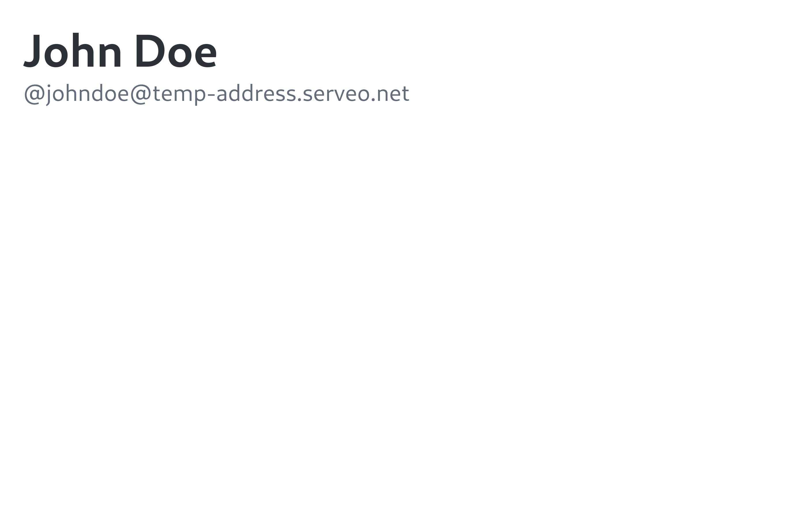

Copy your fediverse handle shown on the above web page, then go into Mastodon
and paste it into the search box in the upper left corner:

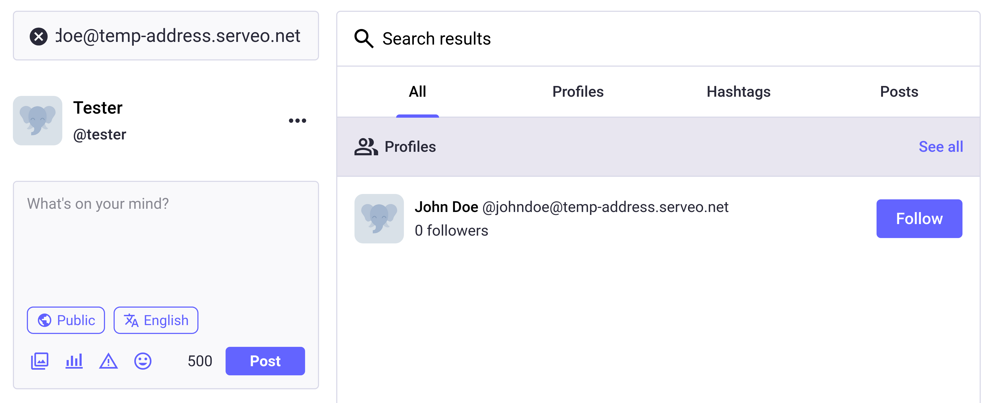

If the actor we created appears in the search results as shown above,
it's working correctly. You can also click on the actor's name in the search
results to go to their profile page:

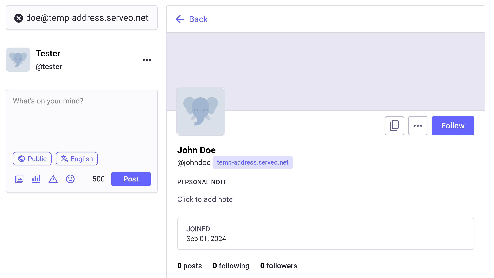

But this is as far as we can go. Don't try to follow yet! For our actor to be followable from other servers, we need to implement an inbox.

> [!NOTE]
> The `fedify tunnel` command automatically disconnects after a while if not
> used. When this happens, you need to press <kbd>Ctrl</kbd>+<kbd>C</kbd> to
> stop it, then run the `fedify tunnel 8000` command again to establish a new
> connection.


Inbox
-----

In ActivityPub, an inbox is an endpoint where an actor receives incoming
activities from other actors. All actors have their own inbox, which is
a URL that can receive activities via HTTP `POST` requests. When another actor
sends a follow request, writes a post, comments, or performs any other
interaction, the corresponding activity is delivered to the recipient's inbox.
The server processes the activities that come into the inbox and responds
appropriately, allowing it to communicate and function as part of the federated
network.

For now, we'll start by implementing the reception of follow requests.

### Table creation

We need to create a `follows` table to hold the actors who follow you
(followers) and the actors you follow (following). Add the following SQL to
the *src/schema.sql* file:

~~~~ sql
CREATE TABLE IF NOT EXISTS follows (
  following_id INTEGER          REFERENCES actors (id),
  follower_id  INTEGER          REFERENCES actors (id),
  created      TEXT    NOT NULL DEFAULT (CURRENT_TIMESTAMP)
                                CHECK (created <> ''),
  PRIMARY KEY (following_id, follower_id)
);
~~~~

Let's create the `follows` table by executing *src/schema.sql* once again:

~~~~ sh
sqlite3 microblog.sqlite3 < src/schema.sql
~~~~

Open the *src/schema.ts* file and define a type to represent records stored
in the `follows` table in JavaScript:

~~~~ typescript twoslash
export interface Follow {
  following_id: number;
  follower_id: number;
  created: string;
}
~~~~

### Receiving `Follow` activity

Now it's time to implement the inbox. Actually, we've already written
the following code in the *src/federation.ts* file earlier:

~~~~ typescript twoslash
import type { Federation } from "@fedify/fedify";
const federation = null as unknown as Federation<void>;
// ---cut-before---
federation.setInboxListeners("/users/{handle}/inbox", "/inbox");
~~~~

Before modifying this code, let's `import` the `Accept` and `Follow` classes
and the `getActorHandle()` function provided by Fedify:

```typescript{2,4,9} twoslash
import {
  Accept,
  Endpoints,
  Follow,
  Person,
  createFederation,
  exportJwk,
  generateCryptoKeyPair,
  getActorHandle,
  importJwk,
} from "@fedify/fedify";
```

Now let's modify the code calling the `~Federation.setInboxListeners()` method
as follows:

~~~~ typescript twoslash
import {
  Accept,
  Endpoints,
  type Federation,
  Follow,
  Person,
  exportJwk,
  generateCryptoKeyPair,
  getActorHandle,
  importJwk,
} from "@fedify/fedify";
const federation = null as unknown as Federation<void>;
import type { Logger } from "@logtape/logtape";
const logger = null as unknown as Logger;
import Database from "better-sqlite3";
const db = new Database("");
interface Actor { id: number; }
// ---cut-before---
federation
  .setInboxListeners("/users/{handle}/inbox", "/inbox")
  .on(Follow, async (ctx, follow) => {
    if (follow.objectId == null) {
      logger.debug("The Follow object does not have an object: {follow}", {
        follow,
      });
      return;
    }
    const object = ctx.parseUri(follow.objectId);
    if (object == null || object.type !== "actor") {
      logger.debug("The Follow object's object is not an actor: {follow}", {
        follow,
      });
      return;
    }
    const follower = await follow.getActor();
    if (follower?.id == null || follower.inboxId == null) {
      logger.debug("The Follow object does not have an actor: {follow}", {
        follow,
      });
      return;
    }
    const followingId = db
      .prepare<unknown[], Actor>(
        `
        SELECT * FROM actors
        JOIN users ON users.id = actors.user_id
        WHERE users.username = ?
        `,
      )
      .get(object.handle)?.id;
    if (followingId == null) {
      logger.debug(
        "Failed to find the actor to follow in the database: {object}",
        { object },
      );
    }
    const followerId = db
      .prepare<unknown[], Actor>(
        `
        -- Add a new follower actor record or update if it already exists
        INSERT INTO actors (uri, handle, name, inbox_url, shared_inbox_url, url)
        VALUES (?, ?, ?, ?, ?, ?)
        ON CONFLICT (uri) DO UPDATE SET
          handle = excluded.handle,
          name = excluded.name,
          inbox_url = excluded.inbox_url,
          shared_inbox_url = excluded.shared_inbox_url,
          url = excluded.url
        WHERE
          actors.uri = excluded.uri
        RETURNING *
        `,
      )
      .get(
        follower.id.href,
        await getActorHandle(follower),
        follower.name?.toString(),
        follower.inboxId.href,
        follower.endpoints?.sharedInbox?.href,
        follower.url?.href,
      )?.id;
    db.prepare(
      "INSERT INTO follows (following_id, follower_id) VALUES (?, ?)",
    ).run(followingId, followerId);
    const accept = new Accept({
      actor: follow.objectId,
      to: follow.actorId,
      object: follow,
    });
    await ctx.sendActivity(object, follower, accept);
  });
~~~~

Let's examine the code carefully. The `~InboxListenerSetters.on()` method
defines the action to take when a specific type of activity is received.
Here, we've written code to record the follower information in the database
when a `Follow` activity is received, and then send an `Accept(Follow)`
activity back to the actor who sent the follow request.

The `follow.objectId` should contain the URI of the actor being followed.
We use the `~Context.parseUri()` method to check if the URI inside it points
to the actor we created.

The `getActorHandle()` function returns the fediverse handle as a string
from the given actor object.

If there's no information about the actor who sent the follow request in
the `actors` table yet, we first add a record. If a record already exists,
we update it with the latest data. Then, we add the follower to the `follows`
table.

Once the record is completed in the database, we use
the `~Context.sendActivity()` method to send an `Accept(Follow)` activity
as a reply to the actor who sent the activity. It takes the sender as the first
parameter, the recipient as the second parameter, and the activity object to
send as the third parameter.

### ActivityPub.Academy

Now it's time to check if follow requests are being received properly.

While it would be fine to test from a regular Mastodon server, let's use
the [ActivityPub.Academy] server, which allows us to see exactly how activities
are exchanged. ActivityPub.Academy is a special Mastodon server for education
and debugging purposes, where you can easily create temporary accounts with
just one click.


After agreeing to the privacy policy, click the *Sign Up* button to create a new
account. The created account will have a randomly generated name and handle,
and will disappear on its own after a day. Instead, you can create new accounts
as many times as you want.

Once you're logged in, paste the handle of the actor we created into the search
box in the top left corner of the screen:

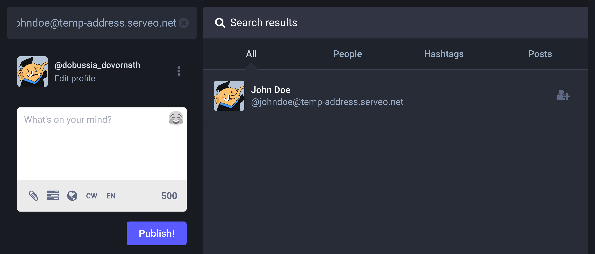

If our actor appears in the search results, click the follow button on the right
to send a follow request. Then click on *Activity Log* in the right menu:

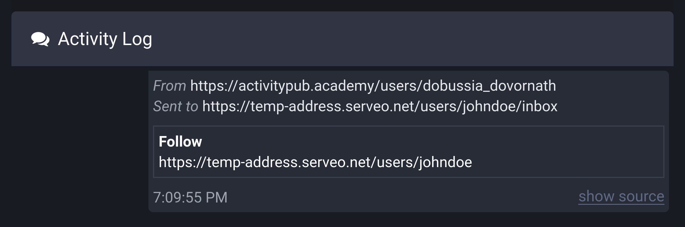

You'll see an indication that a `Follow` activity was sent from
the ActivityPub.Academy server to the inbox of the actor we created by clicking
the follow button just now. You can see the contents of the activity by clicking
*show source* in the bottom right:


[ActivityPub.Academy]: https://activitypub.academy/

### Testing

Now that we've confirmed that the activity was sent well, it's time to check if
our inbox code is working properly. First, let's see if a record was created
properly in the `follows` table:

~~~~ sh
echo "SELECT * FROM follows;" | sqlite3 -table microblog.sqlite3
~~~~

If the follow request was processed successfully, you should see a result like
this (of course, the time will be different):

| `following_id` | `follower_id` |       `created`       |
|----------------|---------------|-----------------------|
| `1`            | `2`           | `2024-09-01 10:19:41` |

Let's also check if a new record was created in the `actors` table:

~~~~ sh
echo "SELECT * FROM actors WHERE id > 1;" | sqlite3 -table microblog.sqlite3
~~~~

| `id` | `user_id` |                         `uri`                          |                 `handle`                  |        `name`        |                         `inbox_url`                          |         `shared_inbox_url`          |                       `url`                       |       `created`       |
|------|-----------|--------------------------------------------------------|-------------------------------------------|----------------------|--------------------------------------------------------------|------------------------------------|---------------------------------------------------|-----------------------|
| `2`  |         | `https://activitypub.academy/users/dobussia_dovornath` | `@dobussia_dovornath@activitypub.academy` | `Dobussia Dovornath` | `https://activitypub.academy/users/dobussia_dovornath/inbox` | `https://activitypub.academy/inbox` | `https://activitypub.academy/@dobussia_dovornath` | `2024-09-01 10:19:41` |

Now, let's look at ActivityPub.Academy's *Activity Log* again.
If the `Accept(Follow)` activity sent by our actor arrived well,
it should be displayed as follows:

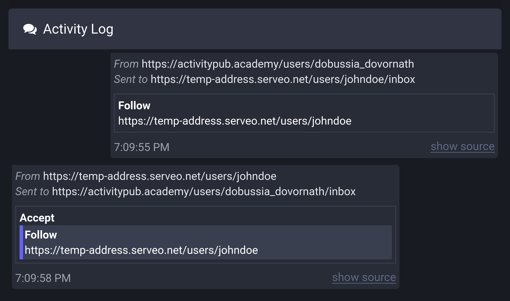

This way, you've implemented your first interaction via ActivityPub!


Unfollow
--------

What happens if an actor from another server unfollows our actor after following
it? Let's test this in [ActivityPub.Academy]. As before, enter our actor's
fediverse handle in the ActivityPub.Academy search box:

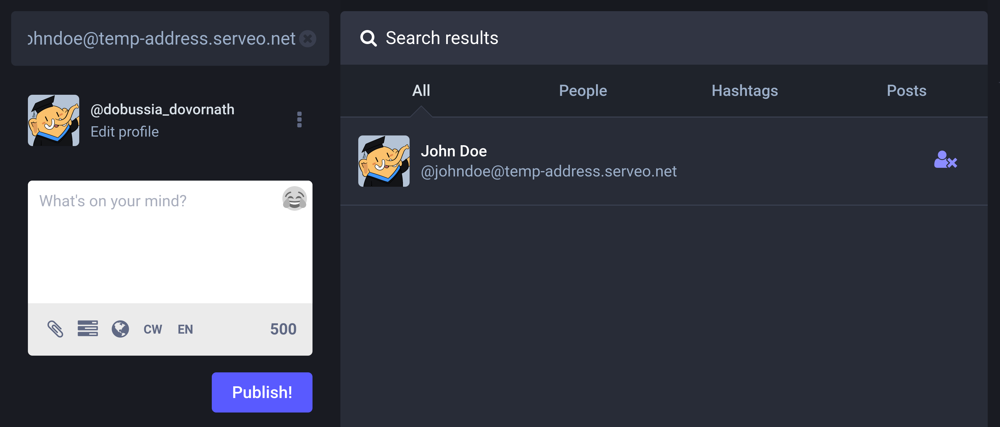

If you look closely, you'll see an unfollow button in place of the follow button
to the right of the actor name. Click this button to unfollow, then go to
the *Activity Log* to see what activity is sent:

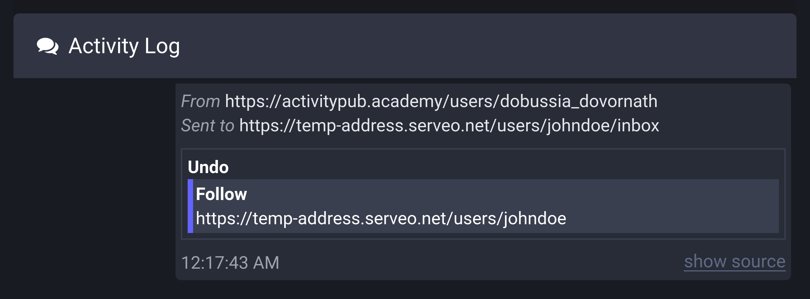

As you can see, an `Undo(Follow)` activity has been sent. If you click *show
source* in the bottom right, you can see the detailed contents of the activity:

~~~~ json
{
  "@context": "https://www.w3.org/ns/activitystreams",
  "id": "https://activitypub.academy/users/dobussia_dovornath#follows/3283/undo",
  "type": "Undo",
  "actor": "https://activitypub.academy/users/dobussia_dovornath",
  "object": {
    "id": "https://activitypub.academy/98b131b8-89ea-49ba-b2bd-3ee0f5a87694",
    "type": "Follow",
    "actor": "https://activitypub.academy/users/dobussia_dovornath",
    "object": "https://temp-address.serveo.net/users/johndoe"
  }
}
~~~~

Looking at this JSON object, you can see that the `Undo(Follow)` activity
includes the `Follow` activity that was received by our inbox earlier. However,
since we haven't defined any behavior for when the inbox receives
an `Undo(Follow)` activity, nothing has happened.

### Receiving `Undo(Follow)` Activity

To implement unfollow, open the *src/federation.ts* file and `import` the `Undo`
class provided by Fedify:

~~~~ typescript twoslash
import {
  Accept,
  Endpoints,
  Follow,
  Person,
  Undo,  // [!code highlight]
  createFederation,
  exportJwk,
  generateCryptoKeyPair,
  getActorHandle,
  importJwk,
} from "@fedify/fedify";
~~~~

Then add `on(Undo, ...)` in succession after `on(Follow, ...)`:

~~~~ typescript{6-23} twoslash
// @errors: 1160
import { type Federation, Follow, Undo } from "@fedify/fedify";
const federation = null as unknown as Federation<void>;
import Database from "better-sqlite3";
const db = new Database("");
// ---cut-before---
federation
  .setInboxListeners("/users/{handle}/inbox", "/inbox")
  .on(Follow, async (ctx, follow) => {
    // ... omitted ...
  })
  .on(Undo, async (ctx, undo) => {
    const object = await undo.getObject();
    if (!(object instanceof Follow)) return;
    if (undo.actorId == null || object.objectId == null) return;
    const parsed = ctx.parseUri(object.objectId);
    if (parsed == null || parsed.type !== "actor") return;
    db.prepare(
      `
      DELETE FROM follows
      WHERE following_id = (
        SELECT actors.id
        FROM actors
        JOIN users ON actors.user_id = users.id
        WHERE users.username = ?
      ) AND follower_id = (SELECT id FROM actors WHERE uri = ?)
      `,
    ).run(parsed.handle, undo.actorId.href);
  });
~~~~

This time, the code is shorter than when processing follow requests.
It checks if the thing inside the `Undo(Follow)` activity is a `Follow`
activity, uses the `parseUri()` method to check if the follow target of
the `Follow` activity to be canceled is our actor, and then deletes
the corresponding record from the `follows` table.

### Testing

We can't unfollow once more since we already clicked the unfollow button in
[ActivityPub.Academy] earlier. We'll have to follow again and then unfollow to
test. But before that, we need to empty the `follows` table. Otherwise,
there will be an error when the follow request comes in because the record
already exists.

Let's empty the `follows` table using the `sqlite3` command:

~~~~ sh
echo "DELETE FROM follows;" | sqlite3 microblog.sqlite3
~~~~

Now press the follow button again, then check the database:

~~~~ sh
echo "SELECT * FROM follows;" | sqlite3 -table microblog.sqlite3
~~~~

If the follow request was processed successfully, you should see a result like
this:

| `following_id` | `follower_id` |       `created`       |
|----------------|---------------|-----------------------|
| `1`            | `2`           | `2024-09-02 01:05:17` |

Now press the unfollow button again, then check the database one more time:

~~~~ sh
echo "SELECT count(*) FROM follows;" | sqlite3 -table microblog.sqlite3
~~~~

If the unfollow request was processed successfully, the record should have
disappeared, so you should see a result like this:

| `count(*)` |
|------------|
| `0`        |


Followers list
--------------

It's cumbersome to view the followers list using the `sqlite3` command every
time, so let's make it possible to view the followers list on the web.

Let's start by adding a new component to the *src/views.tsx* file.
First, `import` the <code>Actor</code> type:

~~~~ typescript twoslash
// @noErrors: 2307
import type { Actor } from "./schema.ts";
~~~~

Then define the `<FollowerList>` component and the `<ActorLink>` component:

~~~~ tsx twoslash
import type { FC } from "hono/jsx";
interface Actor {
  id: number;
  uri: string;
  name: string | null;
  handle: string;
  url: string | null;
}
// ---cut-before---
export interface FollowerListProps {
  followers: Actor[];
}

export const FollowerList: FC<FollowerListProps> = ({ followers }) => (
  <>
    <h2>Followers</h2>
    <ul>
      {followers.map((follower) => (
        <li key={follower.id}>
          <ActorLink actor={follower} />
        </li>
      ))}
    </ul>
  </>
);

export interface ActorLinkProps {
  actor: Actor;
}

export const ActorLink: FC<ActorLinkProps> = ({ actor }) => {
  const href = actor.url ?? actor.uri;
  return actor.name == null ? (
    <a href={href} class="secondary">
      {actor.handle}
    </a>
  ) : (
    <>
      <a href={href}>{actor.name}</a>{" "}
      <small>
        (
        <a href={href} class="secondary">
          {actor.handle}
        </a>
        )
      </small>
    </>
  );
};
~~~~

The `<ActorLink>` component is used to represent a single actor,
and the `<FollowerList>` component uses the `<ActorLink>` component
to represent the list of followers. As you can see, since JSX doesn't
have conditional statements or loops, we're using the ternary operator
and the [`Array.map()`] method.

Now let's create an endpoint to display the followers list.
Open the *src/app.tsx* file and `import` the `<FollowerList>` component:

~~~~ typescript twoslash
// @noErrors: 2307
import { FollowerList, Layout, Profile, SetupForm } from "./views.tsx";
~~~~

Then add a request handler for `GET /users/{username}/followers`:

~~~~ tsx twoslash
import { Hono } from "hono";
const app = new Hono();
import type { FC } from "hono/jsx";
export const Layout: FC = (props) => <html/>;
export const FollowerList: FC = () => <></>;
import Database from "better-sqlite3";
const db = new Database("");
interface Actor {}
// ---cut-before---
app.get("/users/:username/followers", async (c) => {
  const followers = db
    .prepare<unknown[], Actor>(
      `
      SELECT followers.*
      FROM follows
      JOIN actors AS followers ON follows.follower_id = followers.id
      JOIN actors AS following ON follows.following_id = following.id
      JOIN users ON users.id = following.user_id
      WHERE users.username = ?
      ORDER BY follows.created DESC
      `,
    )
    .all(c.req.param("username"));
  return c.html(
    <Layout>
      <FollowerList followers={followers} />
    </Layout>,
  );
});
~~~~

Now, shall we check if it's displaying correctly? There should be followers,
so with `fedify tunnel` running, follow our actor from another Mastodon server
or [ActivityPub.Academy]. After the follow request is accepted, open
the <http://localhost:8000/users/johndoe/followers> page in your web browser,
and you should see something like this:

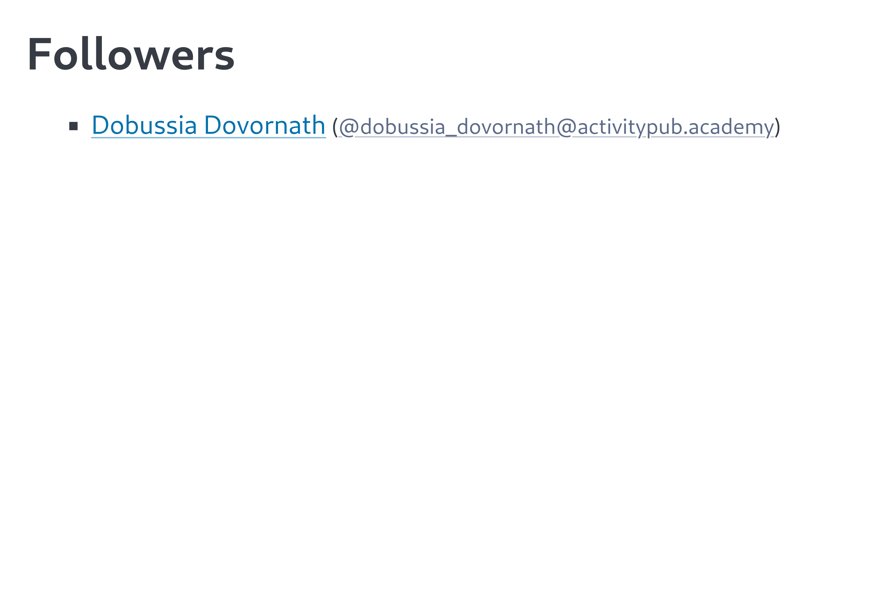

Now that we've created the followers list, it would be nice to display
the number of followers on the profile page as well. Open the *src/views.tsx*
file again and modify the `<Profile>` component as follows:

~~~~ tsx{20-23} twoslash
import type { FC } from "hono/jsx";
// ---cut-before---
export interface ProfileProps {
  name: string;
  username: string;   // [!code highlight]
  handle: string;
  followers: number;  // [!code highlight]
}

export const Profile: FC<ProfileProps> = ({
  name,
  username,   // [!code highlight]
  handle,
  followers,  // [!code highlight]
}) => (
  <>
    <hgroup>
      <h1>
        <a href={`/users/${username}`}>{name}</a>
      </h1>
      <p>
        <span style="user-select: all;">{handle}</span> &middot;{" "}
        <a href={`/users/${username}/followers`}>
          {followers === 1 ? "1 follower" : `${followers} followers`}
        </a>
      </p>
    </hgroup>
  </>
);
~~~~

Two props have been added to `ProfileProps`. `followers` is a prop that holds
the number of followers, as the name suggests. `username` receives
the username that will go into the URL to link to the followers list.

Now go back to the *src/app.tsx* file and modify the `GET /users/{username}`
request handler as follows:

~~~~ tsx{5-15,21,23} twoslash
import { Hono } from "hono";
const app = new Hono();
import type { FC } from "hono/jsx";
export const Layout: FC = (props) => <html/>;
export interface ProfileProps {
  name: string;
  username: string;
  handle: string;
  followers: number;
}
export const Profile: FC<ProfileProps> = () => <></>;
import Database from "better-sqlite3";
const db = new Database("");
interface User {
  id: number;
  username: string;
}
interface Actor { name: string; }
const user = {} as unknown as User & Actor;
const handle = "" as string;
// ---cut-before---
app.get("/users/:username", async (c) => {
  // ... omitted ...
  if (user == null) return c.notFound();

  // biome-ignore lint/style/noNonNullAssertion: Always returns a single record
  const { followers } = db
    .prepare<unknown[], { followers: number }>(
      `
      SELECT count(*) AS followers
      FROM follows
      JOIN actors ON follows.following_id = actors.id
      WHERE actors.user_id = ?
      `,
    )
    .get(user.id)!;
  // ... omitted ...
  return c.html(
    <Layout>
      <Profile
        name={user.name ?? user.username}
        username={user.username}
        handle={handle}
        followers={followers}
      />
    </Layout>,
  );
});
~~~~

SQL that counts the number of records in the `follows` table in the database
has been added. Now, let's check the changed profile page. When you open
the <http://localhost:8000/users/johndoe> page in your web browser,
you should see something like this:

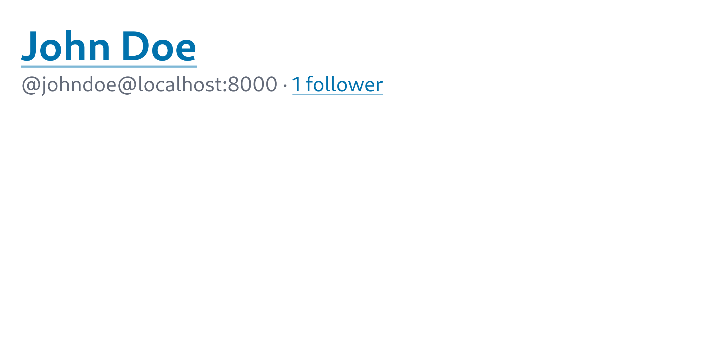

[`Array.map()`]: https://developer.mozilla.org/en-US/docs/Web/JavaScript/Reference/Global_Objects/Array/map


Followers collection
--------------------

However, there's one problem. Let's look up our actor from a Mastodon server
that is *not* ActivityPub.Academy. (You know how to look it up, right?
With the server exposed to the public internet, enter the actor's handle in
the Mastodon search box.) When you view our actor's profile in Mastodon,
you might notice something strange:

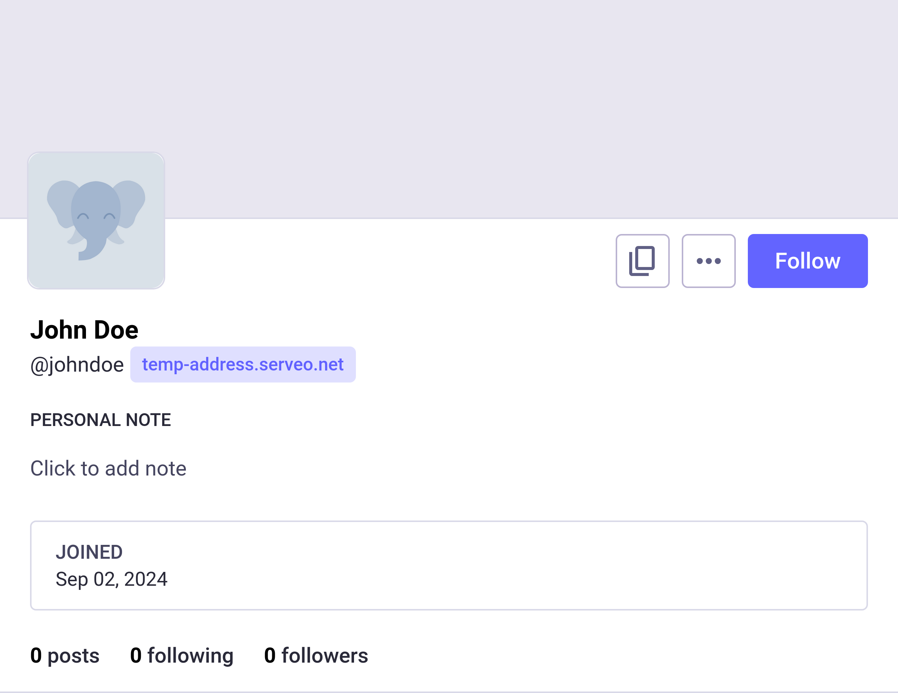

The number of followers is shown as 0. This is because our actor is not
exposing the followers list via ActivityPub. To expose the followers list in
ActivityPub, we need to define a followers collection.

Open the *src/federation.ts* file and `import` the `Recipient` type provided
by Fedify:

~~~~ typescript twoslash
import {
  Accept,
  Endpoints,
  Follow,
  Person,
  Undo,
  createFederation,
  exportJwk,
  generateCryptoKeyPair,
  getActorHandle,
  importJwk,
  type Recipient,  // [!code highlight]
} from "@fedify/fedify";
~~~~

Then add a followers collection dispatcher at the bottom:

~~~~ typescript twoslash
import { type Federation, type Recipient } from "@fedify/fedify";
const federation = null as unknown as Federation<void>;
import Database from "better-sqlite3";
const db = new Database("");
interface Actor {
  uri: string;
  inbox_url: string;
  shared_inbox_url: string | null;
}
// ---cut-before---
federation
  .setFollowersDispatcher(
    "/users/{handle}/followers",
    (ctx, handle, cursor) => {
      const followers = db
        .prepare<unknown[], Actor>(
          `
          SELECT followers.*
          FROM follows
          JOIN actors AS followers ON follows.follower_id = followers.id
          JOIN actors AS following ON follows.following_id = following.id
          JOIN users ON users.id = following.user_id
          WHERE users.username = ?
          ORDER BY follows.created DESC
          `,
        )
        .all(handle);
      const items: Recipient[] = followers.map((f) => ({
        id: new URL(f.uri),
        inboxId: new URL(f.inbox_url),
        endpoints:
          f.shared_inbox_url == null
            ? null
            : { sharedInbox: new URL(f.shared_inbox_url) },
      }));
      return { items };
    },
  )
  .setCounter((ctx, handle) => {
    const result = db
      .prepare<unknown[], { cnt: number }>(
        `
        SELECT count(*) AS cnt
        FROM follows
        JOIN actors ON actors.id = follows.following_id
        JOIN users ON users.id = actors.user_id
        WHERE users.username = ?
        `,
      )
      .get(handle);
    return result == null ? 0 : result.cnt;
  });
~~~~

The `~Federation.setFollowersDispatcher()` method creates a followers
collection object to respond to when a `GET /users/{handle}/followers` request
comes in. Although the SQL is a bit long, it essentially gets the list of
actors following the actor with the `handle` parameter. The `items` contains
`Recipient` objects, and the `Recipient` type looks like this:

~~~~ typescript twoslash
export interface Recipient {
  readonly id: URL | null;
  readonly inboxId: URL | null;
  readonly endpoints?: {
    sharedInbox: URL | null;
  } | null;
}
~~~~

The `id` property contains the actor's unique IRI, and `inboxId` contains
the URL of the actor's personal inbox. `endpoints.sharedInbox` contains
the URL of the actor's shared inbox. Since we have all that information in
our `actors` table, we can fill the `items` array with that information.

The `~CollectionCallbackSetters.setCounter()` method gets the total number of
the followers collection. Here too, the SQL is a bit complex, but in summary,
it's counting the number of actors following the actor with the `handle`
parameter.

Now, let's check if the followers collection is working properly by using
the `fedify lookup` command:

~~~~ sh
fedify lookup http://localhost:8000/users/johndoe/followers
~~~~

If implemented correctly, you should see a result like this:

~~~~ console
✔ Looking up the object...
OrderedCollection {
  totalItems: 1,
  items: [ URL "https://activitypub.academy/users/dobussia_dovornath" ]
}
~~~~

However, just creating a followers collection like this doesn't let other
servers know where the followers collection is. So we need to link to
the followers collection in the actor dispatcher:

~~~~ typescript twoslash
import { type Federation, Person } from "@fedify/fedify";
const federation = null as unknown as Federation<void>;
// ---cut-before---
federation
  .setActorDispatcher("/users/{handle}", async (ctx, handle) => {
    // ... omitted ...
    return new Person({
      // ... omitted ...
      followers: ctx.getFollowersUri(handle),  // [!code highlight]
    });
  })
~~~~

Let's look up the actor with `fedify lookup` again:

~~~~ sh
fedify lookup http://localhost:8000/users/johndoe
~~~~

If you see a `"followers"` property included in the result as shown below,
it's correct:

~~~~ console
✔ Looking up the object...
Person {
  ... omitted ...
  inbox: URL "http://localhost:8000/users/johndoe/inbox",
  followers: URL "http://localhost:8000/users/johndoe/followers",
  endpoints: Endpoints { sharedInbox: URL "http://localhost:8000/inbox" }
}
~~~~

Now, let's look up our actor in Mastodon again. But the result might be a bit
disappointing:


The number of followers is still shown as 0. This is because Mastodon caches
information about actors from other servers. There are ways to update this,
but they're not as easy as pressing the <kbd>F5</kbd> key:

 -  One way is to wait for a week. Mastodon clears the cache that holds
    information about actors from other servers 7 days after the last update.

 -  Another way is to send an `Update` activity, but this requires tedious
    coding.

 -  Or you could try looking it up from another Mastodon server where
    the cache hasn't been created yet.

 -  The last method is to turn off and on `fedify tunnel` to get a new
    temporary domain assigned.

If you want to see the correct number of followers displayed on another
Mastodon server, try one of the methods I've listed.


Posts
-----

Now, it's finally time to implement posts. Unlike a typical blog,
the microblog we're creating should be able to store posts created on other
servers as well. Let's design with this in mind.

### Table creation

Let's start by creating a `posts` table. Open the *src/schema.sql* file and
add the following SQL:

~~~~ sql
CREATE TABLE IF NOT EXISTS posts (
  id       INTEGER NOT NULL PRIMARY KEY,
  uri      TEXT    NOT NULL UNIQUE CHECK (uri <> ''),
  actor_id INTEGER NOT NULL REFERENCES actors (id),
  content  TEXT    NOT NULL,
  url      TEXT             CHECK (url LIKE 'https://%' OR url LIKE 'http://%'),
  created  TEXT    NOT NULL DEFAULT (CURRENT_TIMESTAMP) CHECK (created <> '')
);
~~~~

 -  The `id` column is the primary key of the table.

 -  The `uri` column holds the unique URI of the post. As mentioned earlier,
    all ActivityPub objects must have a unique URI.

 -  The `actor_id` column points to the actor who wrote the post.

 -  The `content` column contains the content of the post.

 -  The `url` column contains the URL where the post is displayed in
    a web browser. There are cases where the URI of an ActivityPub object and
    the URL of the page displayed in a web browser match, but there are also
    cases where they don't, so a separate column is necessary. However,
    it can be empty.

 -  The `created` column contains the time the post was created.

Let's execute the SQL to create the `posts` table:

~~~~ sh
sqlite3 microblog.sqlite3 < src/schema.sql
~~~~

Also define a `Post` type in the *src/schema.ts* file to represent records
that will be stored in the `posts` table in JavaScript:

~~~~ typescript twoslash
export interface Post {
  id: number;
  uri: string;
  actor_id: number;
  content: string;
  url: string | null;
  created: string;
}
~~~~

### Home page

To write a post, there needs to be a form somewhere, right? Come to think of it,
we haven't properly created the home page yet. Let's add a post creation form to
the home page.

First, open the *src/views.tsx* file and `import` the `User` type:

~~~~ typescript twoslash
// @noErrors: 2307
import type { Actor, User } from "./schema.ts";
~~~~

Then define the `<Home>` component:

~~~~ tsx twoslash
import type { FC } from "hono/jsx";
interface User {
  username: string;
}
interface Actor {
  name: string;
}
// ---cut-before---
export interface HomeProps {
  user: User & Actor;
}

export const Home: FC<HomeProps> = ({ user }) => (
  <>
    <hgroup>
      <h1>{user.name}'s microblog</h1>
      <p>
        <a href={`/users/${user.username}`}>{user.name}'s profile</a>
      </p>
    </hgroup>
    <form method="post" action={`/users/${user.username}/posts`}>
      <fieldset>
        <label>
          <textarea name="content" required={true} placeholder="What's up?" />
        </label>
      </fieldset>
      <input type="submit" value="Post" />
    </form>
  </>
);
~~~~

Then open the *src/app.tsx* file and `import` the `<Home>` component we just
defined:

~~~~ typescript twoslash
// @noErrors: 2307
import { FollowerList, Home, Layout, Profile, SetupForm } from "./views.tsx";
~~~~

And modify the existing `GET /` request handler:

~~~~ tsx twoslash
import { Hono } from "hono";
const app = new Hono();
import Database from "better-sqlite3";
const db = new Database("");
interface Actor {}
interface User {}
import type { FC } from "hono/jsx";
export const Layout: FC = (props) => <html/>;
export const Home: FC = () => <></>;
// ---cut-before---
app.get("/", (c) => {
  const user = db
    .prepare<unknown[], User & Actor>(
      `
      SELECT users.*, actors.*
      FROM users
      JOIN actors ON users.id = actors.user_id
      LIMIT 1
      `,
    )
    .get();
  if (user == null) return c.redirect("/setup");

  return c.html(
    <Layout>
      <Home user={user} />
    </Layout>,
  );
});
~~~~

If you've done this much, let's check if the home page comes out well.
When you open the <http://localhost:8000/> page in your web browser,
you should see something like this:


### Record insertion

Now that we've created the post creation form, we need code to actually save
the post content to the `posts` table.

First, open the *src/federation.ts* file and `import` the `Note` class provided
by Fedify:

~~~~ typescript twoslash
import {
  Accept,
  Endpoints,
  Follow,
  Note,  // [!code highlight]
  Person,
  Undo,
  createFederation,
  exportJwk,
  generateCryptoKeyPair,
  getActorHandle,
  importJwk,
  type Recipient,
} from "@fedify/fedify";
~~~~

Add the following code:

~~~~ typescript twoslash
import { type Federation, Note } from "@fedify/fedify";
const federation = null as unknown as Federation<void>;
// ---cut-before---
federation.setObjectDispatcher(
  Note,
  "/users/{handle}/posts/{id}",
  (ctx, values) => {
    return null;
  },
);
~~~~

This code doesn't do much yet, but it's needed to determine the permalink
format of the posts. We'll implement it properly later.

In ActivityPub, the content of posts is exchanged in HTML format. Therefore,
we need to convert the content received in plain text format to HTML format.
At this time, we need the *[stringify-entities]* package to convert characters
like `<` and `>` to HTML entities like `&lt;` and `&gt;`:

~~~~ sh
npm add stringify-entities
~~~~

Then open the *src/app.tsx* file and `import` the installed package:

~~~~ typescript twoslash
import { stringifyEntities } from "stringify-entities";
~~~~

Also `import` the `Post` type and the `Note` class provided by Fedify:

~~~~ typescript twoslash
// @noErrors: 2307
import type { Actor, Post, User } from "./schema.ts";
import { Note } from "@fedify/fedify";
~~~~

And implement the `POST /users/{username}/posts` request handler:

~~~~ typescript twoslash
import { stringifyEntities } from "stringify-entities";
import { type Federation, Note } from "@fedify/fedify";
const fedi = null as unknown as Federation<void>;
import { Hono } from "hono";
const app = new Hono();
import Database from "better-sqlite3";
const db = new Database("");
interface Actor { id: number; }
interface Post { id: number; }
// ---cut-before---
app.post("/users/:username/posts", async (c) => {
  const username = c.req.param("username");
  const actor = db
    .prepare<unknown[], Actor>(
      `
      SELECT actors.*
      FROM actors
      JOIN users ON users.id = actors.user_id
      WHERE users.username = ?
      `,
    )
    .get(username);
  if (actor == null) return c.redirect("/setup");
  const form = await c.req.formData();
  const content = form.get("content")?.toString();
  if (content == null || content.trim() === "") {
    return c.text("Content is required", 400);
  }
  const ctx = fedi.createContext(c.req.raw, undefined);
  const url: string | null = db.transaction(() => {
    const post = db
      .prepare<unknown[], Post>(
        `
        INSERT INTO posts (uri, actor_id, content)
        VALUES ('https://localhost/', ?, ?)
        RETURNING *
        `,
      )
      .get(actor.id, stringifyEntities(content, { escapeOnly: true }));
    if (post == null) return null;
    const url = ctx.getObjectUri(Note, {
      handle: username,
      id: post.id.toString(),
    }).href;
    db.prepare("UPDATE posts SET uri = ?, url = ? WHERE id = ?").run(
      url,
      url,
      post.id,
    );
    return url;
  })();
  if (url == null) return c.text("Failed to create post", 500);
  return c.redirect(url);
});
~~~~

Although it's a normal code that adds a record to the `posts` table, there's
one peculiar part. To get the URI of the ActivityPub object representing
the post, `posts.id` needs to be determined first, so we first insert
a temporary URI `https://localhost/` into the `posts.uri` column to add
the record, then use the determined `posts.id` to get the actual URI using
the `getObjectUri()` method and update the record.

Now, let's open the <http://localhost:8000/> page in your web browser and
create a post:

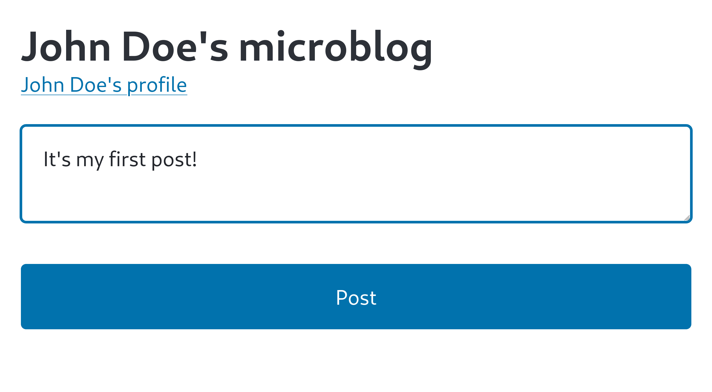

When you press the *Post* button to create a post, unfortunately you'll get
a `404 Not Found` error:


This is because we implemented it to redirect to the post's permalink,
but we haven't implemented the post page yet. However, a record should have
been created in the `posts` table. Let's check:

~~~~ sh
echo "SELECT * FROM posts;" | sqlite3 -table microblog.sqlite3
~~~~

You should see a result like this:

| `id` |                     `uri`                     | `actor_id` |       `content`       |                     `url`                     |       `created`       |
|------|-----------------------------------------------|------------|-----------------------|-----------------------------------------------|-----------------------|
| `1`  | `http://localhost:8000/users/johndoe/posts/1` | `1`        | `It's my first post!` | `http://localhost:8000/users/johndoe/posts/1` | `2024-09-02 08:10:55` |

[stringify-entities]: https://github.com/wooorm/stringify-entities

### Post page

To prevent the `404 Not Found` error after creating a post, let's implement
the post page.

Open the *src/views.tsx* file and `import` the `Post` type:

~~~~ typescript twoslash
// @noErrors: 2307
import type { Actor, Post, User } from "./schema.ts";
~~~~

Then define the `<PostPage>` component and the `<PostView>` component:

~~~~ tsx twoslash
import type { FC } from "hono/jsx";
export interface ProfileProps {
  name: string;
  username: string;
  handle: string;
  followers: number;
}
interface Actor { } interface Post {
  uri: string;
  url: string | null;
  content: string;
  created: string;
}
const Profile: FC<ProfileProps> = () => <></>;
export interface ActorLinkProps { actor: Actor; }
const ActorLink: FC<ActorLinkProps> = () => <></>;
// ---cut-before---
export interface PostPageProps extends ProfileProps, PostViewProps {}

export const PostPage: FC<PostPageProps> = (props) => (
  <>
    <Profile
      name={props.name}
      username={props.username}
      handle={props.handle}
      followers={props.followers}
    />
    <PostView post={props.post} />
  </>
);

export interface PostViewProps {
  post: Post & Actor;
}

export const PostView: FC<PostViewProps> = ({ post }) => (
  <article>
    <header>
      <ActorLink actor={post} />
    </header>
    {/* biome-ignore lint/security/noDangerouslySetInnerHtml: */}
    <div dangerouslySetInnerHTML={{ __html: post.content }} />
    <footer>
      <a href={post.url ?? post.uri}>
        <time datetime={new Date(post.created).toISOString()}>
          {post.created}
        </time>
      </a>
    </footer>
  </article>
);
~~~~

Now let's load the post data from the database and render it with
the `<PostPage>` component. Open the *src/app.tsx* file and `import`
the `<PostPage>` component we just defined:

~~~~ typescript twoslash
// @noErrors: 2307
import {
  FollowerList,
  Home,
  Layout,
  PostPage,  // [!code highlight]
  Profile,
  SetupForm,
} from "./views.tsx";
~~~~

And implement the `GET /users/{username}/posts/{id}` request handler:

~~~~ tsx twoslash
import { Hono } from "hono";
const app = new Hono();
import Database from "better-sqlite3";
const db = new Database("");
interface Actor { name: string | null; handle: string; }
interface Post { id: number; actor_id: number; }
interface User { username: string; }
import type { FC } from "hono/jsx";
export const Layout: FC = (props) => <html/>;
export interface ProfileProps {
  name: string;
  username: string;
  handle: string;
  followers: number;
}
export interface PostViewProps { post: Post & Actor; }
export interface PostPageProps extends ProfileProps, PostViewProps {}
export const PostPage: FC<PostPageProps> = () => <></>;
// ---cut-before---
app.get("/users/:username/posts/:id", (c) => {
  const post = db
    .prepare<unknown[], Post & Actor & User>(
      `
      SELECT users.*, actors.*, posts.*
      FROM posts
      JOIN actors ON actors.id = posts.actor_id
      JOIN users ON users.id = actors.user_id
      WHERE users.username = ? AND posts.id = ?
      `,
    )
    .get(c.req.param("username"), c.req.param("id"));
  if (post == null) return c.notFound();

  // biome-ignore lint/style/noNonNullAssertion: Always returns a single record
  const { followers } = db
    .prepare<unknown[], { followers: number }>(
      `
      SELECT count(*) AS followers
      FROM follows
      WHERE follows.following_id = ?
      `,
    )
    .get(post.actor_id)!;
  return c.html(
    <Layout>
      <PostPage
        name={post.name ?? post.username}
        username={post.username}
        handle={post.handle}
        followers={followers}
        post={post}
      />
    </Layout>,
  );
});
~~~~

Now let's open the <http://localhost:8000/users/johndoe/posts/1> page that
gave a `404 Not Found` error earlier in your web browser:

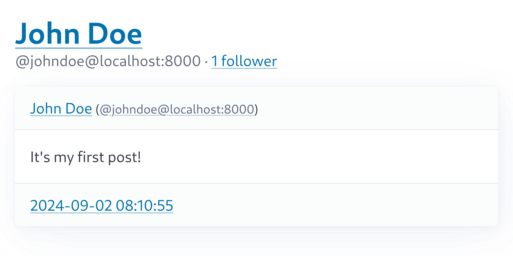

### `Note` object dispatcher

Now, can we check if the post can be viewed from other Mastodon servers?
First, use `fedify tunnel` to expose the local server to the public internet.

In that state, try entering the post's permalink
<https://temp-address.serveo.net/users/johndoe/posts/1> (replace with your
temporary domain name) in the Mastodon search box:

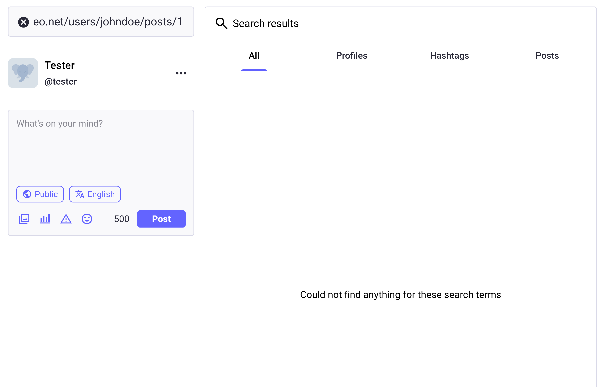

Unfortunately, the search results are empty. This is because we haven't exposed
the post as an ActivityPub object. Let's expose the post as an ActivityPub
object.

Before implementation, we need to install a necessary library. Because
the [Temporal API] used by Fedify to represent time is not yet built into
Node.js, we need the *[@js-temporal/polyfill]* package to polyfill it:

~~~~ sh
npm add @js-temporal/polyfill
~~~~

Open the *src/federation.ts* file and `import` the installed package:

~~~~ typescript twoslash
import { Temporal } from "@js-temporal/polyfill";
~~~~

Also `import` the `Post` type and the `PUBLIC_COLLECTION` constant provided by
Fedify:

~~~~ typescript twoslash
// @noErrors: 2307
import {
  Accept,
  Endpoints,
  Follow,
  Note,
  PUBLIC_COLLECTION,  // [!code highlight]
  Person,
  Undo,
  createFederation,
  exportJwk,
  generateCryptoKeyPair,
  getActorHandle,
  importJwk,
  type Recipient,
} from "@fedify/fedify";
import type {
  Actor,
  Key,
  Post,  // [!code highlight]
  User,
} from "./schema.ts";
~~~~

Short posts like microblog posts are usually represented as `Note` in
ActivityPub. We've already created an empty implementation of the object
dispatcher for the `Note` class:

~~~~ typescript twoslash
import { type Federation, Note } from "@fedify/fedify";
const federation = null as unknown as Federation<void>;
// ---cut-before---
federation.setObjectDispatcher(
  Note,
  "/users/{handle}/posts/{id}",
  (ctx, values) => {
    return null;
  },
);
~~~~

Let's modify this as follows:

~~~~ typescript twoslash
import { Temporal } from "@js-temporal/polyfill";
import { type Federation, Note, PUBLIC_COLLECTION } from "@fedify/fedify";
const federation = null as unknown as Federation<void>;
import Database from "better-sqlite3";
const db = new Database("");
interface Post { id: number; content: string; created: string; }
// ---cut-before---
federation.setObjectDispatcher(
  Note,
  "/users/{handle}/posts/{id}",
  (ctx, values) => {
    const post = db
      .prepare<unknown[], Post>(
        `
        SELECT posts.*
        FROM posts
        JOIN actors ON actors.id = posts.actor_id
        JOIN users ON users.id = actors.user_id
        WHERE users.username = ? AND posts.id = ?
        `,
      )
      .get(values.handle, values.id);
    if (post == null) return null;
    return new Note({
      id: ctx.getObjectUri(Note, values),
      attribution: ctx.getActorUri(values.handle),
      to: PUBLIC_COLLECTION,
      cc: ctx.getFollowersUri(values.handle),
      content: post.content,
      mediaType: "text/html",
      published: Temporal.Instant.from(`${post.created.replace(" ", "T")}Z`),
      url: ctx.getObjectUri(Note, values),
    });
  },
);
~~~~

The property values filled when creating the `Note` object have the following
roles:

 -  Putting `ctx.getActorUri(values.handle)` in the `attribution` property
    indicates that the author of this post is the actor we created.

 -  Putting `PUBLIC_COLLECTION` in the `to` property indicates that this
    post is a public post.

 -  Putting `ctx.getFollowersUri(values.handle)` in the `cc` property indicates
    that this post is delivered to followers, but this itself doesn't have much
    meaning.

Now, let's try entering the post's permalink
<https://temp-address.serveo.net/users/johndoe/posts/1> (replace with your
temporary domain name) in the Mastodon search box again:

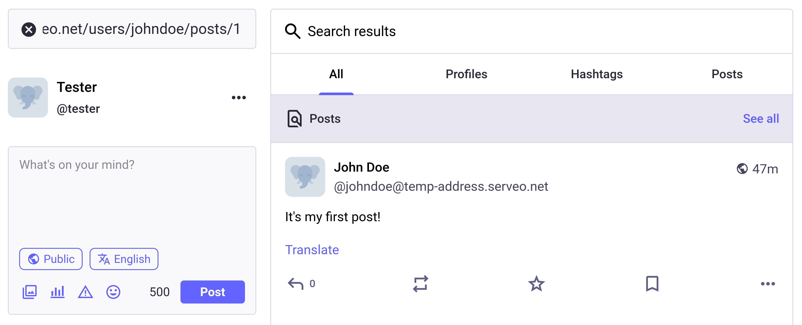

This time, our created post appears properly in the search results!

[Temporal API]: https://tc39.es/proposal-temporal/docs/
[@js-temporal/polyfill]: https://github.com/js-temporal/temporal-polyfill

### Sending `Create(Note)` activity

However, even if you follow our created actor from Mastodon, newly created posts
won't appear in the Mastodon timeline. This is because Mastodon doesn't
automatically fetch new posts; instead, the side that created the new post needs
to send a `Create(Note)` activity to notify that a new post has been created.

Let's modify the code to send a `Create(Note)` activity when creating a post.
Open the *src/app.tsx* file and `import` the `Create` class provided by Fedify:

~~~~ typescript twoslash
import { Create, Note } from "@fedify/fedify";
~~~~

Then modify the `POST /users/{username}/posts` request handler as follows:

~~~~ typescript{4,24,26-40} twoslash
import { stringifyEntities } from "stringify-entities";
import { Create, type Federation, Note } from "@fedify/fedify";
const fedi = null as unknown as Federation<void>;
import { Hono } from "hono";
const app = new Hono();
import Database from "better-sqlite3";
const db = new Database("");
interface Post { id: number; }
interface Actor { id: number; }
const actor = {} as unknown as Actor;
const content = "" as string;
const username = "" as string;
// ---cut-before---
app.post("/users/:username/posts", async (c) => {
  // ... omitted ...
  const ctx = fedi.createContext(c.req.raw, undefined);
  const post: Post | null = db.transaction(() => {
    const post = db
      .prepare<unknown[], Post>(
        `
        INSERT INTO posts (uri, actor_id, content)
        VALUES ('https://localhost/', ?, ?)
        RETURNING *
        `,
      )
      .get(actor.id, stringifyEntities(content, { escapeOnly: true }));
    if (post == null) return null;
    const url = ctx.getObjectUri(Note, {
      handle: username,
      id: post.id.toString(),
    }).href;
    db.prepare("UPDATE posts SET uri = ?, url = ? WHERE id = ?").run(
      url,
      url,
      post.id,
    );
    return post;
  })();
  if (post == null) return c.text("Failed to create post", 500);
  const noteArgs = { handle: username, id: post.id.toString() };
  const note = await ctx.getObject(Note, noteArgs);
  await ctx.sendActivity(
    { handle: username },
    "followers",
    new Create({
      id: new URL("#activity", note?.id ?? undefined),
      object: note,
      actors: note?.attributionIds,
      tos: note?.toIds,
      ccs: note?.ccIds,
    }),
  );
  return c.redirect(ctx.getObjectUri(Note, noteArgs).href);
});
~~~~

The `getObject()` method returns the ActivityPub object created by the object
dispatcher. Here, it will return a `Note` object. We put that `Note` object in
the `object` property when creating the `Create` object. We set the `tos`
(plural of `to`) and `ccs` (plural of `cc`) properties of the activity the same
as the `Note` object. We set an arbitrary unique URI for the `id` of
the activity.

> [!TIP]
> The `id` property of the activity object doesn't necessarily need to be
> an accessible URI. It just needs to be unique.

The second parameter of the `sendActivity()` method is where the recipients go,
and here we've specified the special option `"followers"`. When this option is
specified, it uses the followers collection dispatcher we implemented earlier
to send the activity to all followers.

Now that we've finished the implementation, let's check if the `Create(Note)`
activity is sent properly.

With the `fedify tunnel` command exposing the local server to the public
internet, go to [ActivityPub.Academy] and follow
*@johndoe@temp-address.serveo.net* (replace the domain name with the temporary
domain name assigned to you). After making sure that the follow request has been
accepted in the followers list, go to <https://temp-address.serveo.net/> (again,
replace the domain name) in your web browser and create a new post.

> [!WARNING]
> When testing activity transmission, you must access via a domain name
> accessible from the public internet, not *localhost*. This is because when
> determining the ID of ActivityPub objects, the URI is constructed based on
> the domain name of the incoming request.

To check if the `Create(Note)` activity was sent well, let's look at
ActivityPub.Academy's *Activity Log*:

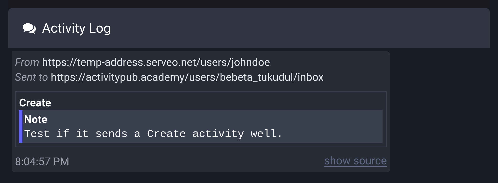

It came in well. Now let's look at the timeline in ActivityPub.Academy:

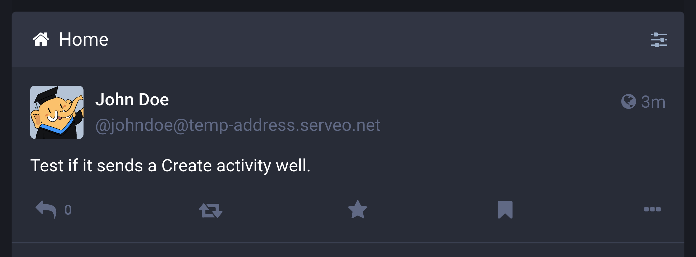

We did it!


Post list on profile page
-------------------------

Currently, the profile page only shows the name, fediverse handle, and number of
followers, but not the actual posts. Let's display the created posts on
the profile page.

First, open the *src/views.tsx* file and add a `<PostList>` component:

~~~~ tsx twoslash
import type { FC } from "hono/jsx";
interface Post { id: number; }
interface Actor {}
interface PostViewProps { post: Post & Actor; }
const PostView: FC<PostViewProps> = () => <></>;
// ---cut-before---
export interface PostListProps {
  posts: (Post & Actor)[];
}

export const PostList: FC<PostListProps> = ({ posts }) => (
  <>
    {posts.map((post) => (
      <div key={post.id}>
        <PostView post={post} />
      </div>
    ))}
  </>
);
~~~~

Then, open the *src/app.tsx* file and `import` the `<PostList>` component
we just defined:

~~~~ typescript twoslash
// @noErrors: 2307
import {
  FollowerList,
  Home,
  Layout,
  PostList,  // [!code highlight]
  PostPage,
  Profile,
  SetupForm,
} from "./views.tsx";
~~~~

Modify the existing `GET /users/{username}` request handler as follows:

~~~~ tsx twoslash
import { Hono } from "hono";
const app = new Hono();
import Database from "better-sqlite3";
const db = new Database("");
interface User { }
interface Actor { user_id: number | null; }
interface Post {}
const user = {} as unknown as User & Actor;
import type { FC } from "hono/jsx";
export const Layout: FC = (props) => <html/>;
export interface PostListProps { posts: (Post & Actor)[]; }
export const PostList: FC<PostListProps> = () => <></>;
// ---cut-before---
app.get("/users/:username", async (c) => {
  // ... omitted ...
  const posts = db
    .prepare<unknown[], Post & Actor>(
      `
      SELECT actors.*, posts.*
      FROM posts
      JOIN actors ON posts.actor_id = actors.id
      WHERE actors.user_id = ?
      ORDER BY posts.created DESC
      `,
    )
    .all(user.user_id);
  // ... omitted ...
  return c.html(
    <Layout>
      // ... omitted ...
      <PostList posts={posts} />
    </Layout>,
  );
});
~~~~

Now, let's open the <http://localhost:8000/users/johndoe> page in your web
browser:

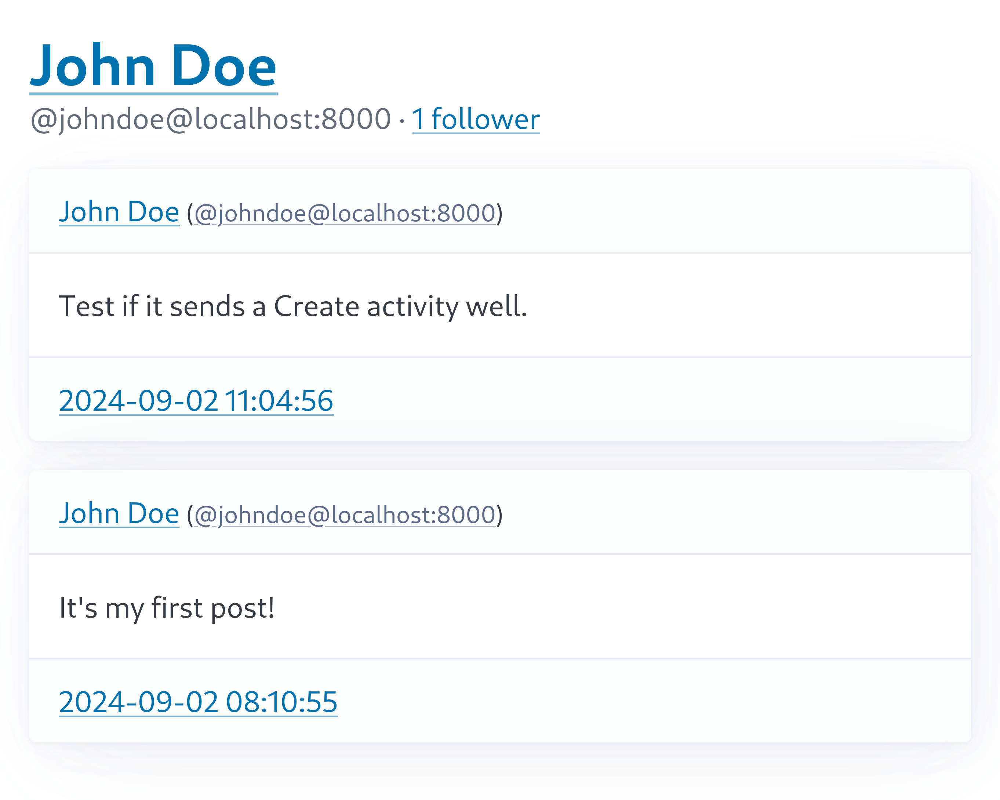

You can see that the created posts are displayed well.


Follow
------

Currently, our actor can receive follow requests from actors on other servers,
but it can't send follow requests to actors on other servers. Since we can't
follow, we also can't see posts created by other actors. So, let's add
the functionality to send follow requests to actors on other servers.

Let's start with the UI. Open the *src/views.tsx* file and modify the existing
`<Home>` component as follows:

~~~~ tsx{6-17} twoslash
import type { FC } from "hono/jsx";
interface User { username: string; }
interface HomeProps { user: User; }
// ---cut-before---
export const Home: FC<HomeProps> = ({ user }) => (
  <>
    <hgroup>
      {/* ... omitted ... */}
    </hgroup>
    <form method="post" action={`/users/${user.username}/following`}>
      {/* biome-ignore lint/a11y/noRedundantRoles: PicoCSS requires role=group */}
      <fieldset role="group">
        <input
          type="text"
          name="actor"
          required={true}
          placeholder="Enter an actor handle (e.g., @johndoe@mastodon.com) or URI (e.g., https://mastodon.com/@johndoe)"
        />
        <input type="submit" value="Follow" />
      </fieldset>
    </form>
    <form method="post" action={`/users/${user.username}/posts`}>
      {/* ... omitted ... */}
    </form>
  </>
);
~~~~

To check if the home page has been modified correctly, open
the <http://localhost:8000/> page in your web browser:


### Sending `Follow` activity

Now that we have the follow request UI, let's write the code to actually send
the `Follow` activity.

Open the *src/app.tsx* file and `import` the `Follow` class and the `isActor()`
and `lookupObject()` functions provided by Fedify:

~~~~ typescript twoslash
import {
  Create,
  Follow,        // [!code highlight]
  isActor,       // [!code highlight]
  lookupObject,  // [!code highlight]
  Note,
} from "@fedify/fedify";
~~~~

Then add a `POST /users/{username}/following` request handler:

~~~~ typescript twoslash
import { type Federation, Follow, isActor, lookupObject } from "@fedify/fedify";
const fedi = null as unknown as Federation<void>;
import { Hono } from "hono";
const app = new Hono();
// ---cut-before---
app.post("/users/:username/following", async (c) => {
  const username = c.req.param("username");
  const form = await c.req.formData();
  const handle = form.get("actor");
  if (typeof handle !== "string") {
    return c.text("Invalid actor handle or URL", 400);
  }
  const actor = await lookupObject(handle.trim());
  if (!isActor(actor)) {
    return c.text("Invalid actor handle or URL", 400);
  }
  const ctx = fedi.createContext(c.req.raw, undefined);
  await ctx.sendActivity(
    { handle: username },
    actor,
    new Follow({
      actor: ctx.getActorUri(username),
      object: actor.id,
      to: actor.id,
    }),
  );
  return c.text("Successfully sent a follow request");
});
~~~~

The `lookupObject()` function looks up ActivityPub objects, including actors.
It takes the unique URI of an ActivityPub object or a fediverse handle as input
and returns the looked-up ActivityPub object.

The `isActor()` function checks if the given ActivityPub object is an actor.

In this code, we're using the `sendActivity()` method to send a `Follow`
activity to the looked-up actor. However, we're not adding any records to
the `follows` table yet. This is because we should add the record after
receiving an `Accept(Follow)` activity from the other party.

### Testing

We need to check if the implemented follow request functionality is working
properly. This time too, we need to send an activity, so use the `fedify tunnel`
command to expose the local server to the public internet, then enter
the <https://temp-address.serveo.net/> page (replace the domain name) in
your web browser:


You need to enter the fediverse handle of the actor you want to follow in
the follow request input field. Here, for easy debugging, let's enter an actor
from [ActivityPub.Academy]. By the way, you can see the handle of the temporary
account logged in to ActivityPub.Academy by clicking on the temporary account
name to go to the profile page and looking just below the name:

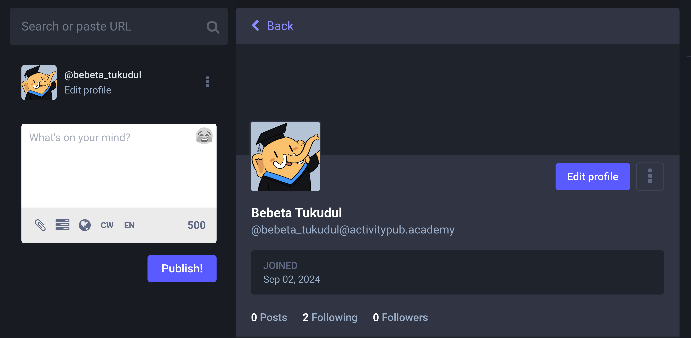

Enter the ActivityPub.Academy actor's handle as follows, then press the *Follow*
button to send a follow request:

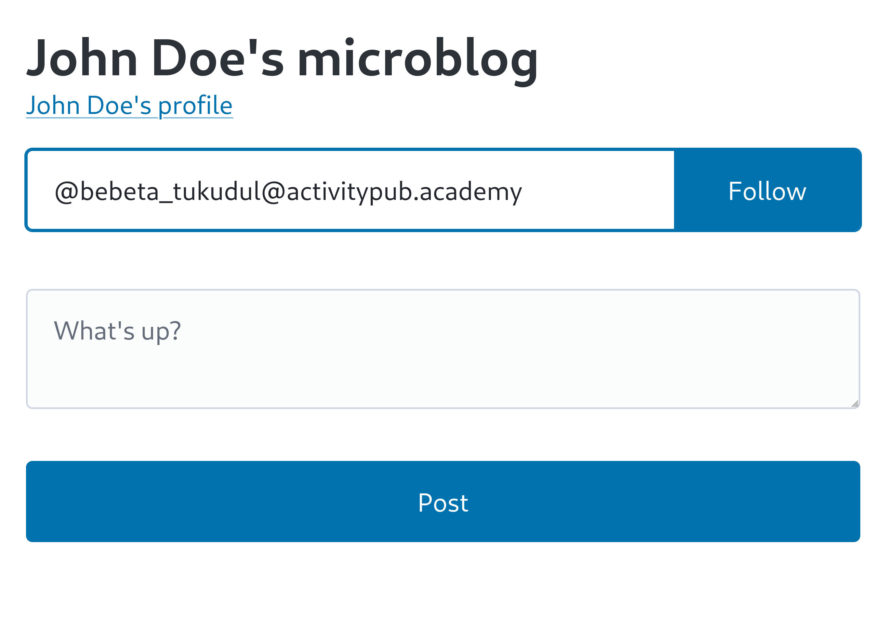

And check ActivityPub.Academy's *Activity Log*:

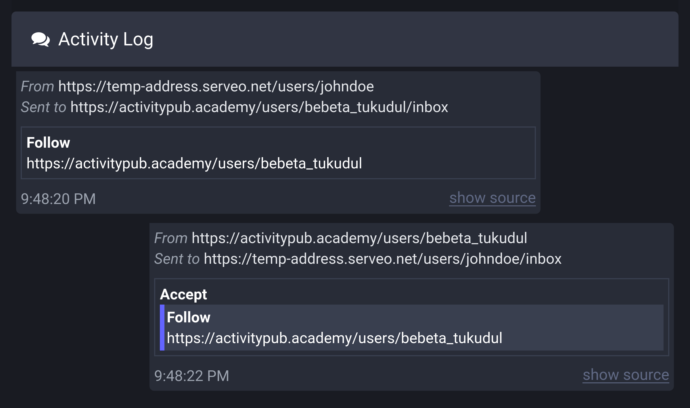

The *Activity Log* shows the `Follow` activity we sent and the `Accept(Follow)`
activity sent in response from ActivityPub.Academy.

If you go to the notifications page in ActivityPub.Academy, you can see that
the follow request has actually arrived:

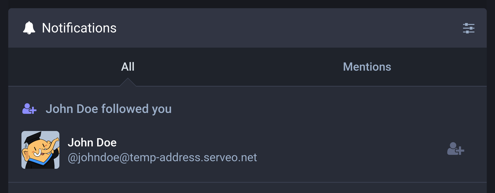

### Receiving `Accept(Follow)` activity

However, we're not taking any action on the received `Accept(Follow)` activity
yet, so we need to implement this part.

Open the *src/federation.ts* file and `import` the `isActor()` function and
`Actor` type provided by Fedify:

~~~~ typescript twoslash
import {
  Accept,
  Endpoints,
  Follow,
  Note,
  PUBLIC_COLLECTION,
  Person,
  Undo,
  createFederation,
  exportJwk,
  generateCryptoKeyPair,
  getActorHandle,
  importJwk,
  isActor,                // [!code highlight]
  type Actor as APActor,  // [!code highlight]
  type Recipient,
} from "@fedify/fedify";
~~~~

We've given the alias `APActor` to the `Actor` type because
the <code>Actor</code> type name is already used in this source file.

Before implementation, let's refactor the code that adds actor information to
the `actors` table when first encountered to make it reusable. Add the following
function:

~~~~ typescript twoslash
import { getActorHandle, isActor, type Actor as APActor } from "@fedify/fedify";
import type { Logger } from "@logtape/logtape";
const logger = {} as unknown as Logger;
import Database from "better-sqlite3";
const db = new Database("");
interface Actor {}
// ---cut-before---
async function persistActor(actor: APActor): Promise<Actor | null> {
  if (actor.id == null || actor.inboxId == null) {
    logger.debug("Actor is missing required fields: {actor}", { actor });
    return null;
  }
  return (
    db
      .prepare<unknown[], Actor>(
        `
        -- Add a new actor record or update if it already exists
        INSERT INTO actors (uri, handle, name, inbox_url, shared_inbox_url, url)
        VALUES (?, ?, ?, ?, ?, ?)
        ON CONFLICT (uri) DO UPDATE SET
          handle = excluded.handle,
          name = excluded.name,
          inbox_url = excluded.inbox_url,
          shared_inbox_url = excluded.shared_inbox_url,
          url = excluded.url
        WHERE
          actors.uri = excluded.uri
        RETURNING *
        `,
      )
      .get(
        actor.id.href,
        await getActorHandle(actor),
        actor.name?.toString(),
        actor.inboxId.href,
        actor.endpoints?.sharedInbox?.href,
        actor.url?.href,
      ) ?? null
  );
}
~~~~

The defined `persistActor()` function adds a record corresponding to the actor
object passed as an argument to the `actors` table. If there's already
a corresponding record in the table, it updates the record.

Change the code doing the same role in the `on(Follow, ...)` part of the inbox
to use the `persistActor()` function:

~~~~ typescript twoslash
import {
  type Actor as APActor,
  type Federation,
  Follow,
  type ParseUriResult,
} from "@fedify/fedify";
const federation = null as unknown as Federation<void>;
import type { Logger } from "@logtape/logtape";
const logger = {} as unknown as Logger;
import Database from "better-sqlite3";
const db = new Database("");
interface Actor { id: number; }
async function persistActor(actor: APActor): Promise<Actor | null> {
  return null;
}
const object = {} as unknown as ParseUriResult;
const followingId = 0 as number;
const follower = {} as unknown as APActor;
// ---cut-before---
federation
  .setInboxListeners("/users/{handle}/inbox", "/inbox")
  .on(Follow, async (ctx, follow) => {
    // ... omitted ...
    if (followingId == null) {
      logger.debug(
        "Failed to find the actor to follow in the database: {object}",
        { object },
      );
    }
    const followerId = (await persistActor(follower))?.id;  // [!code highlight]
    db.prepare(
      "INSERT INTO follows (following_id, follower_id) VALUES (?, ?)",
    ).run(followingId, followerId);
    // ... omitted ...
  })
~~~~

Now that we've finished refactoring, let's implement the behavior when receiving
an `Accept(Follow)` activity in the inbox:

~~~~ typescript twoslash
import {
  Accept,
  type Actor as APActor,
  type Federation,
  Follow,
  isActor,
} from "@fedify/fedify";
const federation = null as unknown as Federation<void>;
import Database from "better-sqlite3";
const db = new Database("");
interface Actor { id: number; }
async function persistActor(actor: APActor): Promise<Actor | null> {
  return null;
}
federation
  .setInboxListeners("/users/{handle}/inbox", "/inbox")
// ---cut-before---
  .on(Accept, async (ctx, accept) => {
    const follow = await accept.getObject();
    if (!(follow instanceof Follow)) return;
    const following = await accept.getActor();
    if (!isActor(following)) return;
    const follower = follow.actorId;
    if (follower == null) return;
    const parsed = ctx.parseUri(follower);
    if (parsed == null || parsed.type !== "actor") return;
    const followingId = (await persistActor(following))?.id;
    if (followingId == null) return;
    db.prepare(
      `
      INSERT INTO follows (following_id, follower_id)
      VALUES (
        ?,
        (
          SELECT actors.id
          FROM actors
          JOIN users ON actors.user_id = users.id
          WHERE users.username = ?
        )
      )
      `,
    ).run(followingId, parsed.handle);
  });
~~~~

Although there's a lot of validity checking code, in summary, it gets the actor
who sent the follow request (`follower`) and the actor who received the follow
request (`following`) from the contents of the `Accept(Follow)` activity and
adds a record to the `follows` table.

### Testing

Now we need to check if it's working well, but there's a problem. When we sent
a follow request earlier, [ActivityPub.Academy] already accepted the follow
request and sent an `Accept(Follow)` activity, so even if we send another follow
request, it will be ignored. Therefore, we need to log out of
ActivityPub.Academy and create a new temporary account to test.

If you've created a new temporary account in ActivityPub.Academy, with the local
server exposed to the public internet using the `fedify tunnel` command, go to
the <https://temp-address.serveo.net/> page (replace the domain name) in your
web browser and send a follow request to the new temporary account on
ActivityPub.Academy.

If the follow request was sent successfully, you should see the `Follow`
activity arriving and the `Accept(Follow)` activity being sent in response in
the *Activity Log*, just like before:

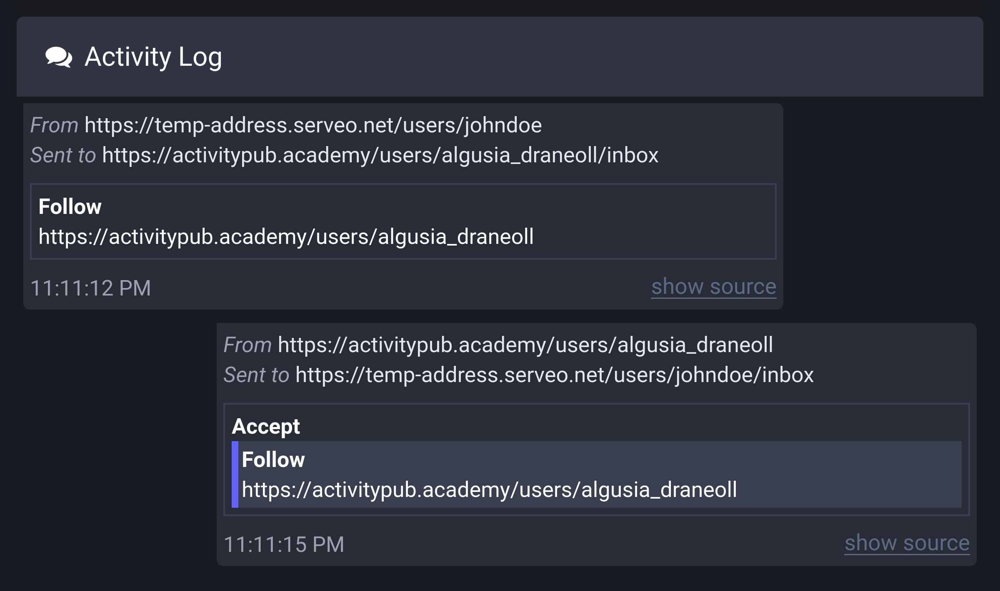

We haven't implemented the following list yet, so let's directly check if
a record has been properly added to the `follows` table:

~~~~ sh
echo "SELECT * FROM follows WHERE follower_id = 1;" | sqlite3 -table microblog.sqlite3
~~~~

If successful, you should see a result like this (the value in
the `following_id` column might be slightly different):

| `following_id` | `follower_id` |       `created`       |
|----------------|---------------|-----------------------|
| `3`            | `1`           | `2024-09-02 14:11:17` |


Following list
--------------

Let's create a page that displays the list of actors our actor is following.

First, open the *src/views.tsx* file and add a `<FollowingList>` component:

~~~~ tsx twoslash
import type { FC } from "hono/jsx";
interface Actor { id: number; }
export interface ActorLinkProps { actor: Actor; }
const ActorLink: FC<ActorLinkProps> = () => <></>;
// ---cut-before---
export interface FollowingListProps {
  following: Actor[];
}

export const FollowingList: FC<FollowingListProps> = ({ following }) => (
  <>
    <h2>Following</h2>
    <ul>
      {following.map((actor) => (
        <li key={actor.id}>
          <ActorLink actor={actor} />
        </li>
      ))}
    </ul>
  </>
);
~~~~

Then, open the *src/app.tsx* file and `import` the `<FollowingList>` component
we just defined:

~~~~ typescript twoslash
// @noErrors: 2307
import {
  FollowerList,
  FollowingList,  // [!code highlight]
  Home,
  Layout,
  PostList,
  PostPage,
  Profile,
  SetupForm,
} from "./views.tsx";
~~~~

And add a handler for the `GET /users/{username}/following` request:

~~~~ tsx twoslash
import { Hono } from "hono";
const app = new Hono();
import Database from "better-sqlite3";
const db = new Database("");
interface Actor {}
import type { FC } from "hono/jsx";
export const Layout: FC = (props) => <html/>;
export interface FollowingListProps { following: Actor[]; }
export const FollowingList: FC<FollowingListProps> = () => <></>;
// ---cut-before---
app.get("/users/:username/following", async (c) => {
  const following = db
    .prepare<unknown[], Actor>(
      `
      SELECT following.*
      FROM follows
      JOIN actors AS followers ON follows.follower_id = followers.id
      JOIN actors AS following ON follows.following_id = following.id
      JOIN users ON users.id = followers.user_id
      WHERE users.username = ?
      ORDER BY follows.created DESC
      `,
    )
    .all(c.req.param("username"));
  return c.html(
    <Layout>
      <FollowingList following={following} />
    </Layout>,
  );
});
~~~~

To check if it's been implemented correctly,
open the <http://localhost:8000/users/johndoe/following> page in your
web browser:

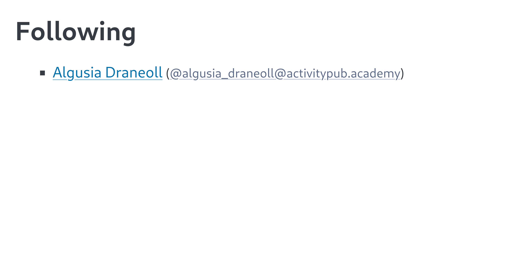


Following count
---------------

Just as we're showing the number of followers, we should also display the number
of accounts the user is following.

Open the *src/views.tsx* file and modify the `<Profile>` component as follows:

~~~~ tsx{23-24} twoslash
import type { FC } from "hono/jsx";
// ---cut-before---
export interface ProfileProps {
  name: string;
  username: string;
  handle: string;
  following: number;  // [!code highlight]
  followers: number;
}

export const Profile: FC<ProfileProps> = ({
  name,
  username,
  handle,
  following,  // [!code highlight]
  followers,
}) => (
  <>
    <hgroup>
      <h1>
        <a href={`/users/${username}`}>{name}</a>
      </h1>
      <p>
        <span style="user-select: all;">{handle}</span> &middot;{" "}
        <a href={`/users/${username}/following`}>{following} following</a>{" "}
        &middot;{" "}
        <a href={`/users/${username}/followers`}>
          {followers === 1 ? "1 follower" : `${followers} followers`}
        </a>
      </p>
    </hgroup>
  </>
);
~~~~

Also modify the `<PostPage>` component as follows:

~~~~ tsx{9} twoslash
import type { FC } from "hono/jsx";
interface ProfileProps {
  name: string;
  username: string;
  handle: string;
  following: number;
  followers: number;
}
interface Post {}
interface Actor {}
interface PostViewProps { post: Post & Actor; }
const PostView: FC<PostViewProps> = () => <></>;
const Profile: FC<ProfileProps> = () => <></>;
// ---cut-before---
export interface PostPageProps extends ProfileProps, PostViewProps {}

export const PostPage: FC<PostPageProps> = (props) => (
  <>
    <Profile
      name={props.name}
      username={props.username}
      handle={props.handle}
      following={props.following}
      followers={props.followers}
    />
    <PostView post={props.post} />
  </>
);
~~~~

Now we need to write code to actually query the database and get the number
of following accounts.

Open the *src/app.tsx* file and modify the `GET /users/{username}` request
handler as follows:

~~~~ tsx{5-15,23} twoslash
import { Hono } from "hono";
const app = new Hono();
import Database from "better-sqlite3";
const db = new Database("");
interface User { id: number; username: string; }
interface Actor { name: string | null; }
interface Post {}
const user = {} as unknown as User & Actor;
const handle = "" as string;
const followers = 0 as number;
const posts = [] as (Post & Actor)[];
import type { FC } from "hono/jsx";
export const Layout: FC = (props) => <html/>;
export interface ProfileProps {
  name: string;
  username: string;
  handle: string;
  following: number;
  followers: number;
}
export const Profile: FC<ProfileProps> = () => <></>;
export interface PostListProps { posts: (Post & Actor)[]; }
export const PostList: FC<PostListProps> = () => <></>;
// ---cut-before---
app.get("/users/:username", async (c) => {
  // ... omitted ...
  if (user == null) return c.notFound();

  // biome-ignore lint/style/noNonNullAssertion: Always returns a single record
  const { following } = db
    .prepare<unknown[], { following: number }>(
      `
      SELECT count(*) AS following
      FROM follows
      JOIN actors ON follows.follower_id = actors.id
      WHERE actors.user_id = ?
      `,
    )
    .get(user.id)!;
  // ... omitted ...
  return c.html(
    <Layout>
      <Profile
        name={user.name ?? user.username}
        username={user.username}
        handle={handle}
        following={following}
        followers={followers}
      />
      <PostList posts={posts} />
    </Layout>,
  );
});
~~~~

Also modify the `GET /users/{username}/posts/{id}` request handler:

~~~~ tsx{5-14,21} twoslash
import { Hono } from "hono";
const app = new Hono();
import Database from "better-sqlite3";
const db = new Database("");
interface User { id: number; username: string; }
interface Actor { name: string | null; handle: string; }
interface Post { actor_id: number; }
const post = {} as unknown as Post & User & Actor;
import type { FC } from "hono/jsx";
export const Layout: FC = (props) => <html/>;
interface ProfileProps {
  name: string;
  username: string;
  handle: string;
  following: number;
  followers: number;
}
interface PostViewProps { post: Post & Actor; }
interface PostPageProps extends ProfileProps, PostViewProps {}
const PostPage: FC<PostPageProps> = () => <></>;
// ---cut-before---
app.get("/users/:username/posts/:id", (c) => {
  // ... omitted ...
  if (post == null) return c.notFound();

  // biome-ignore lint/style/noNonNullAssertion: Always returns a single record
  const { following, followers } = db
    .prepare<unknown[], { following: number; followers: number }>(
      `
      SELECT sum(follows.follower_id = ?) AS following,
             sum(follows.following_id = ?) AS followers
      FROM follows
      `,
    )
    .get(post.actor_id, post.actor_id)!;
  return c.html(
    <Layout>
      <PostPage
        name={post.name ?? post.username}
        username={post.username}
        handle={post.handle}
        following={following}
        followers={followers}
        post={post}
      />
    </Layout>,
  );
});
~~~~

If you've made all these modifications,
open the <http://localhost:8000/users/johndoe> page in your web browser:

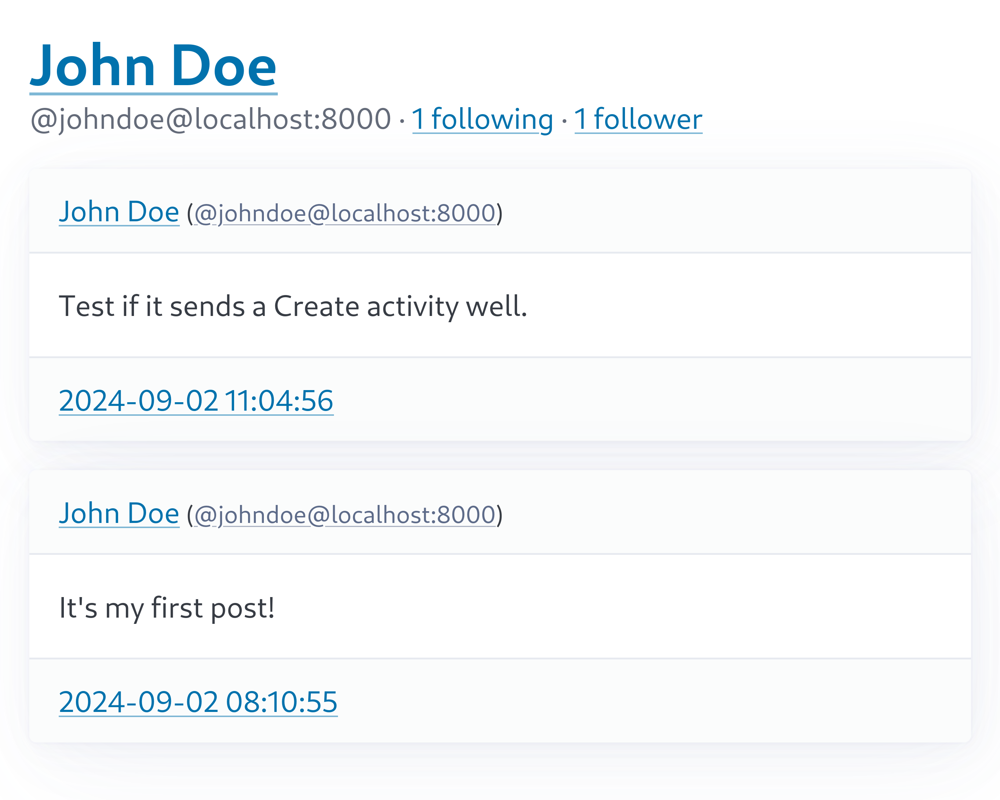


Timeline
--------

We've implemented many things, but posts written on other Mastodon servers are
still not visible. As you might have guessed from the process so far, just as we
sent a `Create(Note)` activity when we wrote a post, we need to receive
a `Create(Note)` activity from other servers to see posts written on other
Mastodon servers.

To see exactly what happens when a post is written on another Mastodon server,
let's create a new post on [ActivityPub.Academy]:


After pressing the *Publish!* button to save the post, go to the *Activity Log*
page and check if the `Create(Note)` activity was indeed sent:

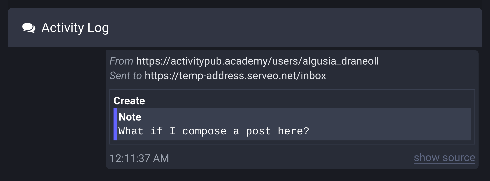

Now we need to write code to receive this sent `Create(Note)` activity.

### Receiving `Create(Note)` activity

Open the *src/federation.ts* file and `import` the `Create` class provided by
Fedify:

~~~~ typescript twoslash
import {
  Accept,
  Create,  // [!code highlight]
  Endpoints,
  Follow,
  Note,
  PUBLIC_COLLECTION,
  Person,
  Undo,
  createFederation,
  exportJwk,
  generateCryptoKeyPair,
  getActorHandle,
  importJwk,
  isActor,
  type Actor as APActor,
  type Recipient,
} from "@fedify/fedify";
~~~~

And add `on(Create, ...)` to the inbox code:

~~~~ typescript twoslash
import {
  type Actor as APActor,
  type Federation,
  Create,
  Note,
  isActor,
} from "@fedify/fedify";
const federation = null as unknown as Federation<void>;
import Database from "better-sqlite3";
const db = new Database("");
interface Actor { id: number; }
async function persistActor(actor: APActor): Promise<Actor | null> {
  return null;
}
federation
  .setInboxListeners("/users/{handle}/inbox", "/inbox")
// ---cut-before---
  .on(Create, async (ctx, create) => {
    const object = await create.getObject();
    if (!(object instanceof Note)) return;
    const actor = create.actorId;
    if (actor == null) return;
    const author = await object.getAttribution();
    if (!isActor(author) || author.id?.href !== actor.href) return;
    const actorId = (await persistActor(author))?.id;
    if (actorId == null) return;
    if (object.id == null) return;
    const content = object.content?.toString();
    db.prepare(
      "INSERT INTO posts (uri, actor_id, content, url) VALUES (?, ?, ?, ?)",
    ).run(object.id.href, actorId, content, object.url?.href);
  });
~~~~

We use the `~Object.getAttribution()` method to get the author, then add
the actor to the `actors` table if it's not already there using
the `persistActor()` function. Then we add a new record to the `posts` table.

To check if the code is working well, let's go back to [ActivityPub.Academy] and
create a post. Open the *Activity Log* to check if the `Create(Note)` activity
was sent, then use the following command to check if a record was indeed added
to the `posts` table:

~~~~ sh
echo "SELECT * FROM posts WHERE actor_id != 1" | sqlite3 -table microblog.sqlite3
~~~~

If a record was indeed added, you should see a result like this:

| `id` |                                      `uri`                                       | `actor_id` |                    `content`                    |                               `url`                                |       `created`       |
|------|----------------------------------------------------------------------------------|------------|-------------------------------------------------|--------------------------------------------------------------------|-----------------------|
| `3`  | `https://activitypub.academy/users/algusia_draneoll/statuses/113068684551948316` | `3`        | `<p>Would it send a Create(Note) activity?</p>` | `https://activitypub.academy/@algusia_draneoll/113068684551948316` | `2024-09-02 15:33:32` |

### Displaying remote posts

Now that we've added remote posts as records in the `posts` table, all that's
left is to display these records well. This is often called a <q>timeline</q>
feature.

First, open the *src/views.tsx* file and modify the `<Home>` component:

~~~~ tsx{3,9} twoslash
import type { FC } from "hono/jsx";
interface User {}
interface Actor {}
interface Post {}
interface PostListProps { posts: Post[]; }
const PostList: FC<PostListProps> = () => <></>;
// ---cut-before---
export interface HomeProps extends PostListProps {
  user: User & Actor;
  posts: Post[];
}

export const Home: FC<HomeProps> = ({ user, posts }) => (
  <>
    {/* ... omitted ... */}
    <PostList posts={posts} />
  </>
);
~~~~

Then, open the *src/app.tsx* file and modify the `GET /` request handler:

~~~~ tsx{5-19,22} twoslash
import { Hono } from "hono";
const app = new Hono();
import Database from "better-sqlite3";
const db = new Database("");
interface User { id: number; }
interface Actor {}
interface Post {}
const user = {} as unknown as User & Actor;
import type { FC } from "hono/jsx";
export const Layout: FC = (props) => <html/>;
export interface PostListProps { posts: Post[]; }
export interface HomeProps extends PostListProps { user: User & Actor; }
export const Home: FC<HomeProps> = () => <></>;
// ---cut-before---
app.get("/", (c) => {
  // ... omitted ...
  if (user == null) return c.redirect("/setup");

  const posts = db
    .prepare<unknown[], Post & Actor>(
      `
      SELECT actors.*, posts.*
      FROM posts
      JOIN actors ON posts.actor_id = actors.id
      WHERE posts.actor_id = ? OR posts.actor_id IN (
        SELECT following_id
        FROM follows
        WHERE follower_id = ?
      )
      ORDER BY posts.created DESC
      `,
    )
    .all(user.id, user.id);
  return c.html(
    <Layout>
      <Home user={user} posts={posts} />
    </Layout>,
  );
});
~~~~

Now that we've implemented everything, let's open the <http://localhost:8000/>
page in your web browser to admire the timeline:

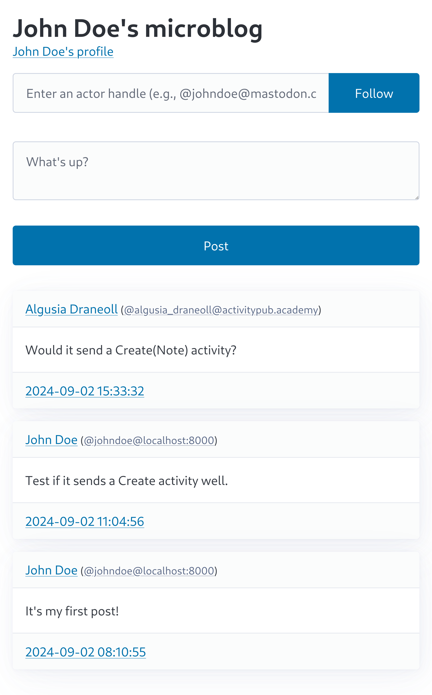

As you can see above, posts created remotely and posts created locally are
displayed in chronological order. How do you like it?

This is all we're going to implement in this tutorial. Based on this, you should
be able to complete your own microblog.


Areas for improvement
---------------------

Unfortunately, the microblog you've completed through this tutorial is not yet
suitable for real use. In particular, there are many vulnerabilities in terms of
security, so it could be dangerous to actually use it.

For those who want to further develop the microblog you've created, you might
want to try solving the following challenges:

 -  Currently, there's no authentication, so anyone can post if they know
    the URL. How about adding a login process to prevent this?

 -  The current implementation directly outputs the HTML contained in the `Note`
    object received via ActivityPub. Therefore, a malicious ActivityPub server
    could send a `Create(Note)` activity containing HTML like `<script>while
    (true) alert('Gotcha!');</script>`. This is called an [XSS] vulnerability.
    How can we prevent such vulnerabilities?

 -  Let's try changing the name of the actor we created by executing
    the following SQL in the SQLite database:

    ~~~~ sql
    UPDATE actors SET name = 'Renamed' WHERE id = 1;
    ~~~~
  
    When we change the actor's name like this, will the changed name be applied
    on other Mastodon servers? If not, what kind of activity should we send to
    apply the change?

 -  Let's try adding a profile picture to the actor. If you're wondering how to
    add a profile picture, try using the `fedify lookup` command to look up
    an actor that already has a profile picture.

 -  Try creating a post with an image attached on another Mastodon server.
    In the timeline we created, the image attached to the post isn't visible.
    How can we display the attached image?

 -  Let's make it possible to mention other actors within a post. What should
    we do to send a notification to the mentioned party? Use the *Activity Log*
    of [ActivityPub.Academy] to find a way.

[XSS]: https://en.wikipedia.org/wiki/Cross-site_scripting


<!-- cSpell: ignore choco winget johndoe Dobussia Dovornath serveo -->
