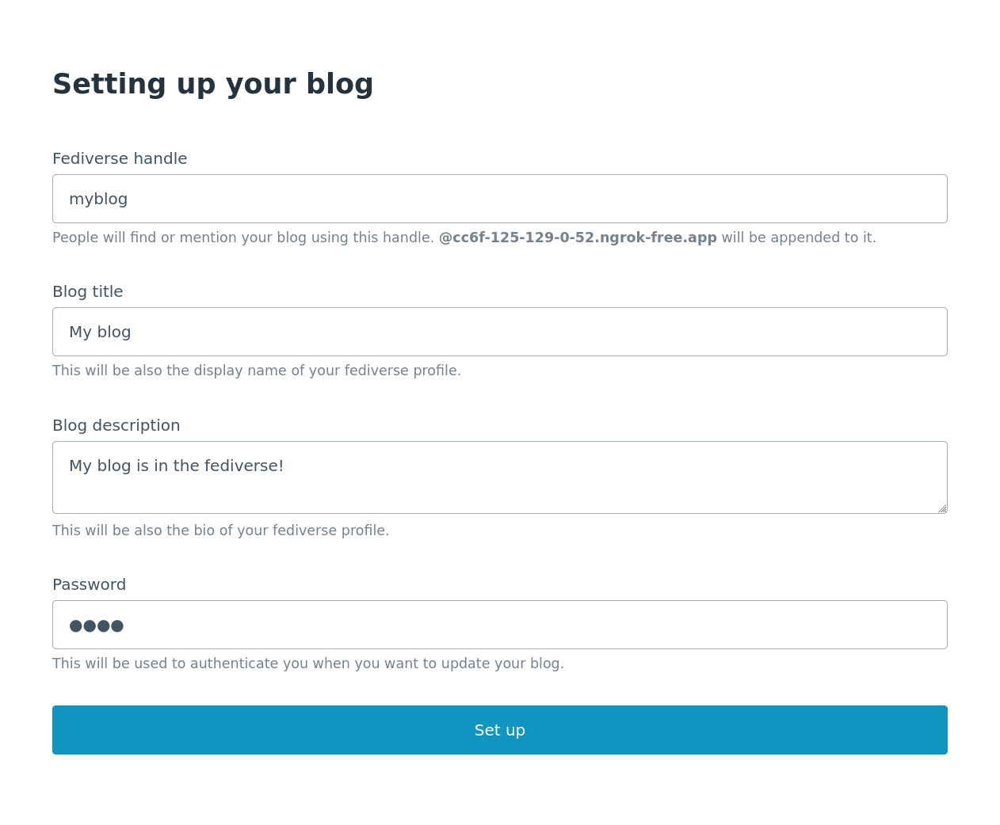
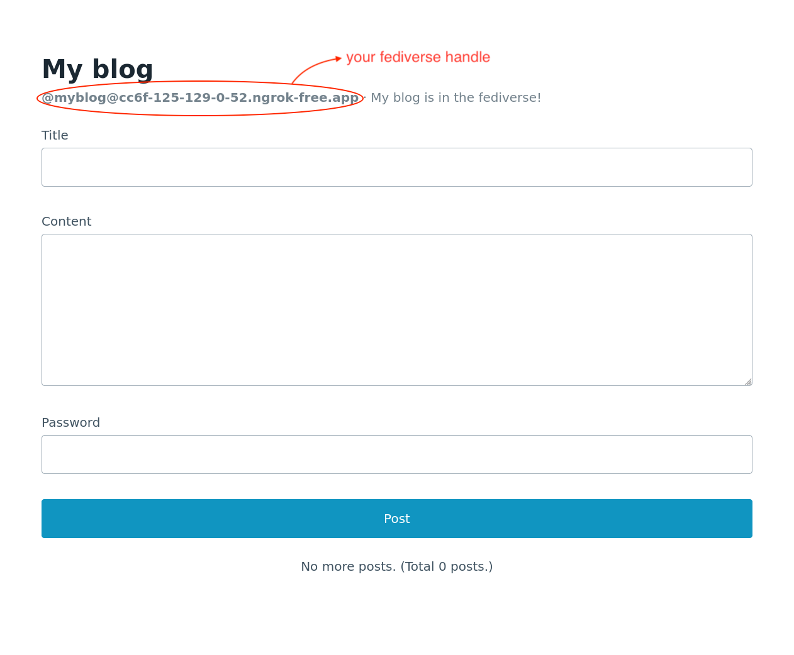

<!-- deno-fmt-ignore-file -->

Federated single-user blog
==========================

> [!TIP]
> The preview of this example is available at <https://fedify-blog.deno.dev/>.

This project is an example of a federated single-user blog.  It is built on top
of the following technologies:

 -  [Deno] for runtime
 -  [Deno KV] for database
 -  [Fresh] for web framework
 -  Fedify for federation

It provides the following features:

 -  Publish a new post
 -  View a post and its comments
 -  View a list of posts
 -  Federate with other servers in the fediverse
     -  Fediverse users can follow/unfollow your blog
     -  Followers can see your posts in their timelines
     -  Followers can reply to your posts

[Deno]: https://deno.com/
[Deno KV]: https://deno.com/kv
[Fresh]: https://fresh.deno.dev/

Usage
-----

Start the project with the following command:

~~~~ sh
deno task start
~~~~

The above command will start the server on port 8000.  You can access the blog
at <http://localhost:8000/>, but in order to federate your server with other
servers in the fediverse, you need to expose your server with a public domain
name in HTTPS.  There are plenty of ways to do this, but one of the easiest
ways for development is to use [ngrok]:[^1]

~~~~ sh
ngrok http 8000
~~~~

At first, you need to set up your blog profile by visiting the root URL of your
blog:

After that, you can start federating your blog with other servers through your
fediverse handle:

[^1]: To grasp the concept of ngrok and how to use it, please refer
      the [official quick start guide][1].

[ngrok]: https://ngrok.com/
[1]: https://ngrok.com/docs/getting-started/

Where to start reading
----------------------

In general, this project is a typical Fresh web app, except that it delegates
federation-related tasks to the Fedify library.  So, if you are not familiar
with Fresh at all, you may want to start with the [Fresh documentation][2].

The most of the federation-related code is in the *federation/mod.ts* file.
This file registers many callbacks to the Fedify library, which are called when
the server receives a federation-related request.

There are few code that interacts with the Fedify library from the Fresh app.
For example, *routes/posts/index.ts* file contains logic to publish a new post,
and there is few lines that enqueue a `Create` activity to the outbox:

~~~~ typescript
// Gets a federation context for enqueueing an activity:
const fedCtx = await federation.createContext(req);
// Enqueues a `Create` activity to the outbox:
await fedCtx.sendActivity(
  { handle: blog.handle },
  await getFollowersAsActors(),
  new Create({
    // (omitted for brevity)
  }),
);
~~~~

Lastly, you'll probably wonder how the `federation` object is integrated with
the Fresh app.  The answer is in the *routes/_middleware.ts* file.  This file
contains a Fresh middleware that intercepts federation-related requests and
passes them to the `federation` object.

We did the best to keep the federation-related logic elaborated in comments,
so we hope you can understand the code by reading the comments too.

[2]: https://fresh.deno.dev/docs
